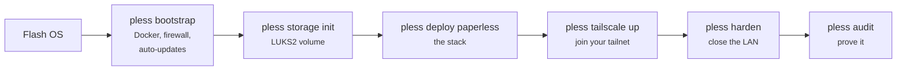

# Getting started

This page gives you the shape of the whole thing in about ten minutes of reading, so you
can decide whether it fits before you buy anything or flash anything.

## What you are building

A document archive that runs on a machine you control, holds your PDFs and scans in a
searchable index with full-text OCR, and is reachable from your phone or laptop anywhere
you have internet — without being reachable from anywhere else.

Three decisions shape everything else:

**Your documents are encrypted at rest.** They live on a LUKS2 volume whose key exists only
in your head and your password manager. The practical consequence is that after every reboot
or power cut, the archive stays locked until you run `pless unlock`. This is not a bug to be
worked around; it is the feature. A stolen machine is a brick.

**Access goes through Tailscale, not the internet.** No ports are forwarded, no domain is
needed, no login page sits on the public internet waiting to be brute-forced. Your devices
join a private network; the archive is only visible on it.

**Nothing listens on your LAN.** Not even SSH, after `pless harden`. This matters because
"it's only on my home network" is not a security model — your Wi-Fi has guests, your TV
phones home, and your smart bulb runs firmware from 2019.

## The flow, end to end



Each step is a single command, and every one of them is safe to run twice. The order matters
in exactly one place: `harden` refuses to run until Tailscale is confirmed working, so you
cannot lock yourself out by getting ahead of yourself.

Budget roughly an hour for a first run, most of it spent waiting for downloads.

## What it costs to run

On a Raspberry Pi you own, electricity is essentially the whole bill — a Pi 5 idling with
this stack draws a few watts, which lands somewhere around **€5–10 per year** at European
rates. Off-site backup to Backblaze B2 is free below 10 GB, which comfortably covers an
archive of a few gigabytes.

If you would rather not own hardware, the same setup runs on a Hetzner CX23 for roughly
**€4–6 per month**. Check [current pricing](https://www.hetzner.com/cloud) before you commit;
it changes.

## What you need

Software on your laptop: Python 3.12 or newer, `ssh`, and [uv](https://docs.astral.sh/uv/).
A [Tailscale](https://tailscale.com/) account — the free tier is generous enough that you
will not hit its limits with a handful of personal devices. A password manager you actually
use, because the encryption passphrase has no recovery path.

Hardware, if you are going the Raspberry Pi route, is covered in detail on the next page:
[Hardware](hardware.md).

## Install the CLI

```bash
git clone https://github.com/kschulst/pless.git
cd pless
uv tool install --editable .
pless --help
```

!!! note "Why not `pip install pless`?"

    Because it is not on PyPI yet. While `pless` is alpha, installing from a clone keeps you
    on a version you can inspect and roll back — and it makes the source you are trusting
    with your documents one `git log` away.

Then create your configuration and check your environment:

```bash
pless init --secrets   # generates strong secrets into .env
pless doctor           # verifies your local setup
```

`pless init --secrets` generates a Paperless admin password, a Django secret key, and a
PostgreSQL password. **Copy them into your password manager immediately.** The `.env` file is
a local cache, not the source of truth — if your laptop dies, the password manager is what
gets you back in.

## Where things live

| Path | What it is |
|---|---|
| `pless.toml` | Configuration. No secrets. Commit it. |
| `.env` | Secrets cache. Git-ignored. Your password manager is the real home. |
| `/opt/paperless` on the target | Everything persistent, on the encrypted volume |

Ready to build it? Continue to [Installation](../installation/index.md).
