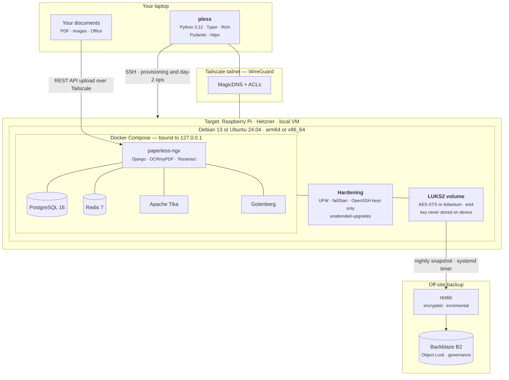

# pless

**A searchable archive of your documents, on hardware you own.**

[Paperless-ngx](https://docs.paperless-ngx.com/) is a document management system for the
paper that accumulates in a life: invoices, receipts, contracts, diplomas, letters from
institutions that still send letters. You feed it scans and PDFs; it runs OCR over them so
the text inside becomes searchable, then sorts them by correspondent, document type and date
— guessing sensibly, and learning from your corrections. What you get back is a filing
cabinet you can grep, reachable from a browser or a phone.

It is open source and self-hosted, which is the point: your tax returns and your children's
birth certificates stay on hardware you control rather than in someone else's product
roadmap.

`pless` sets that up and operates it — on a Raspberry Pi in your home, a cloud server, or a
local VM — with two properties most self-hosting guides skip:

- **Encrypted at rest.** Your documents live on a LUKS2-encrypted volume. The key is never
  stored on the machine. Someone who walks off with your Pi gets hardware and an operating
  system, not your tax returns.
- **Invisible on your network.** After hardening, nothing listens on your LAN. Paperless is
  bound to localhost, the database publishes no ports at all, and SSH accepts connections
  only over your Tailscale network. A compromised device on your Wi-Fi finds nothing to
  attack.

!!! warning "Alpha — read this before you rely on it"

    `pless` is under active development. Import, backup, restore and the restore rehearsal all
    work and are covered by tests, but **the full flow has not been drilled on real Raspberry Pi
    hardware** ([#4](https://github.com/kschulst/pless/issues/4)) and the Hetzner target has
    never been run against the live API ([#5](https://github.com/kschulst/pless/issues/5)).

    Several real bugs in this project were invisible to tests and obvious the moment the code ran
    on a machine. Keep your originals until `pless backup status` shows a successful run that
    includes them — `pless preflight` will tell you the same thing.

## What it looks like

```console
$ pless doctor
✓ Python 3.12.3 (requires 3.12+)
✓ ssh found in PATH
✓ pless.toml found
✓ SSH key found (~/.ssh/id_ed25519)

Host
✓ [host] points at archive.local
✓ SSH key found (~/.ssh/id_ed25519)
✓ [storage] data_mode=file (100 GB LUKS file)

All clear. Next: pless bootstrap
```

```console
$ pless audit
✓ listening sockets: Nothing listens outside loopback — your LAN sees zero ports.
✓ firewall: UFW active, default deny, no LAN-open rules.
✓ docker ports: No container publishes outside loopback.
✓ ssh: Key-based authentication only.
✓ encrypted storage: Data lives on the LUKS device /dev/mapper/paperless-data.
```

## The whole stack

Everything below the dashed line runs on your machine. Nothing in it is reachable from your
local network once hardening is applied.



## Why not just run Docker Compose yourself?

You can, and many people do. `pless` exists because the interesting parts are not the
`docker compose up` — they are everything around it: making the disk encrypted without
storing the key on the box, making sure a reboot doesn't silently start the stack against
an unlocked volume, keeping the firewall honest when Docker writes its own iptables rules
behind your back, and having a single command that tells you whether any of that has
quietly stopped being true.

## Where to go next

<div class="grid cards" markdown>

-   :material-rocket-launch: **[Getting started](getting-started/index.md)**

    What you need, what it costs, and a ten-minute overview of the whole flow.

-   :material-download: **[Installation](installation/index.md)**

    Step by step, from an unboxed Raspberry Pi to a running archive.

-   :material-wrench: **[Maintenance](maintenance.md)**

    Day-to-day operation: updates, health checks, logs, disk usage.

-   :material-book-open-variant: **[Cookbook](cookbook/index.md)**

    Recipes for the situations you will actually run into.

</div>

## Status

`pless` is verified end to end on Debian 13 and Ubuntu 24.04. Here is the honest state of
each piece:

| Capability | Status |
|---|---|
| Provisioning (Docker, firewall, fail2ban, auto-updates) | :material-check: Working |
| Encrypted storage with LUKS2 | :material-check: Working |
| Deploying the Paperless-ngx stack | :material-check: Working |
| Tailscale access and LAN hardening | :material-check: Working |
| Exposure auditing | :material-check: Working |
| Readiness gate (`pless preflight`) | :material-check: Working |
| Importing your documents (`pless docs upload`) | :material-check: Working |
| Off-site backup with restic | :material-check: Working |
| Restore, and the restore rehearsal on a fresh machine | :material-check: Working |
| Bucket provisioning with Object Lock (`pless b2 provision`) | :material-check: Working |
| Raspberry Pi as a target | :material-progress-clock: Documented, [awaiting hardware validation](https://github.com/kschulst/pless/issues/4) |
| Hetzner Cloud as a target | :material-progress-clock: Code and unit tests, [not validated live](https://github.com/kschulst/pless/issues/5) |
| Alternative unlock methods | :material-close: [Not built](https://github.com/kschulst/pless/issues/6) |
| Secrets from a vault rather than `.env` | :material-close: [Not built](https://github.com/kschulst/pless/issues/7) |
| Web setup wizard | :material-close: [Not built](https://github.com/kschulst/pless/issues/8) |

### What comes next

The archive and its backup are both built. What is left is **proof on real hardware**: the Pi
flow is documented and tested but has never run on a Pi ([#4](https://github.com/kschulst/pless/issues/4)),
and the Hetzner target has never met the live API ([#5](https://github.com/kschulst/pless/issues/5)).
Given this project's history — a package name that differs between distributions, an apt lock held
by cloud-init, a service listening on an interface nobody considered — that gap matters more than
any remaining feature.

After that: unlocking without typing the passphrase every time
([#6](https://github.com/kschulst/pless/issues/6)), resolving secrets from a vault rather than
`.env` ([#7](https://github.com/kschulst/pless/issues/7)), and a web setup wizard
([#8](https://github.com/kschulst/pless/issues/8)) — which is why the core modules are kept free
of `typer` and `rich`.

What is being worked on, and the reasoning behind each piece, lives in the
[issue tracker](https://github.com/kschulst/pless/issues). This page says what works today;
the tracker says what is being done about the rest.
