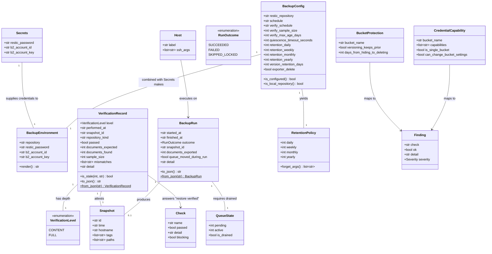

# Backup to an encrypted restic repository, drilled by a real restore

## Requirements

Implement an off-site, encrypted backup of the Paperless archive that the operator can prove
works, by restoring it rather than by inspecting it.

- **Create** a repeatable backup run on the target: establish quiescence, produce a portable
  `document_exporter` export and a point-in-time `pg_dump`, and snapshot both into one restic
  repository, on a schedule owned by systemd.
- **Create** two levels of verification — a cheap content comparison that runs on its own timer,
  and a full restore rehearsal into a throwaway VM — and persist the result so `pless preflight`
  can stop hard-coding `backup_verified=False`.
- **Create** the escape hatches that make an encrypted archive usable: extract documents in the
  clear on demand, mirror the repository elsewhere still encrypted, and prune history
  deliberately.
- **Verify** mechanically, in `pless audit`, that the target's key is scoped to one bucket and
  cannot change bucket settings. This limits blast radius; it is explicitly *not* tamper
  resistance, which no key the machine holds can provide
  ([ADR 0017](../../adr/0017-tamper-resistance-in-the-bucket.md)).

**Boundaries.** Restore targets a fresh installation; restoring into an installation that already
holds documents is out of scope. The operating system is not backed up — it is reproducible from
`pless bootstrap`, and only the archive is irreplaceable. `pless` does not model storage
providers: the repository is an opaque restic location string, so B2, a local directory and
anything reachable through rclone are the same concept to the tool.

**Value.** Until this exists, the machine holds the only copy of whatever was imported, and
`preflight` correctly refuses a green light. Afterwards, the archive survives the loss of the
machine, and the operator has evidence rather than a belief.

## Entities

Existing types are reused unchanged: `targets.Host`, `config.Config`, `config.Secrets`,
`audit.Finding`, `audit.Severity`, `preflight.Check`, `sshexec.SshResult`. `config.BackupConfig`
gains fields; no existing field changes name or meaning. `config.Secrets` already declares
`restic_password`, `b2_account_id` and `b2_account_key` — this work is what finally uses them.
No wrapper type is introduced where a `str` already carries the meaning: the repository stays a
plain string, and its "kind" is a derived property, never a stored enum.

## Approach

1. **Backup as a pipeline executed on the target**:
   - The operator's laptop is asleep, travelling or reinstalled too often to be part of a backup
     schedule. Everything runs on the always-on machine, invoked either by the operator over SSH
     or by a systemd timer on the machine itself.
   - Delivery follows the pattern `deploy` already uses for `paperless.service`: render a unit
     and its environment file, write them over SSH with secrets on stdin, `daemon-reload`,
     enable. `pless` owns the rendering; systemd owns the schedule.
   - The pipeline is: drain the task queue → `pg_dump` → `document_exporter` → re-check the queue
     → `restic backup` of both artefacts in one snapshot → write a run record. Staging happens
     in `/opt/paperless/backups`, on the encrypted volume, so intermediate plaintext is protected
     at rest without extra work.

2. **Repository as an opaque location string, not a typed backend**:
   - restic already speaks local paths, S3/B2 and — through rclone — Dropbox and much else.
     `pless` passes the string through and stays out of the storage-backend business.
   - The only place the string is inspected is presentation and safety messaging: a repository
     that does not start with a remote scheme is a local repository, and documentation and
     `audit` must say plainly that a local repository protects against deletion and corruption,
     not against loss of the machine.
   - Consequence: "explore alternative locations such as Dropbox" becomes a documentation
     question, with the honest caveat that rclone's OAuth flow on a headless machine is
     materially harder than B2, rather than a code question.

3. **Tamper resistance comes from Object Lock**
   ([ADR 0017](../../adr/0017-tamper-resistance-in-the-bucket.md), verified against a real bucket
   in issue #14):
   - restic creates and deletes files in `locks/` during ordinary operation, so a key without
     delete permission cannot be used. The target therefore holds a key with full read/write/
     delete on **one bucket only**, and no capability to change bucket settings.
   - The bucket carries Object Lock in **governance** mode with a default retention period, and
     the machine's key lacks `bypassGovernance`. Versioning plus a lifecycle rule does *not*
     work: `deleteFiles`, which restic requires for `locks/`, authorises permanent version
     deletion, and lifecycle rules govern only automatic cleanup.
   - The repository is an **`s3:` URL** against B2's S3 endpoint, not `b2:`. A delete through the
     S3 API becomes a delete marker, which Object Lock permits; the native backend removes
     versions outright, which a lock refuses.
   - What `audit` can check — that the key is scoped to one bucket and cannot change bucket
     settings — it checks as a finding that fails a build. What it must not do is report the
     setup as tamper-resistant on that basis.

4. **Quiescence by draining the queue, with a loud timeout**:
   - Paperless has no pause API. Since import goes through the REST API (ADR 0012), the Celery
     task queue is the real signal: poll pending (Redis list length) and active (Celery inspect)
     until both are zero for two consecutive polls.
   - On timeout, fail — never export anyway. After the export, re-check: if the queue moved
     during the run, the snapshot is still taken but the run record records the skew, because a
     silent inconsistency is worse than a noted one.

5. **Verification is one code path at two depths**:
   - Content level restores a random sample from the latest snapshot and compares the document
     count against the count the run recorded.

     **Amended during Stage 2.** The canvas originally specified hashing each sampled file against
     Paperless's own manifest entry. restic verifies content hashes as it restores, so a sample
     that comes back *is* a sample proven intact, and `restic ls` gives the document count without
     moving any data. Nothing now depends on Paperless manifest internals, and the cheap level
     stays cheap.
   - The comparison baseline is pinned to the **snapshot's own manifest and the run record that
     produced it** — not the live archive, which will legitimately have moved on by the time
     verification runs. A drift against the live count is reported as information, never as a
     failure.
   - Full level restores everything into a throwaway VM through the existing `vm` module, starts
     Paperless, imports and confirms the documents are present. It is the only level that also
     tests whether the *procedure* works.
   - Both write a `VerificationRecord` to the target, beside the data it describes
     ([ADR 0019](../../adr/0019-the-verification-record-lives-on-the-target.md)). `preflight`
     reads it and treats a record older than `verify_max_age_days` as not verified.
   - The record names a snapshot id, which makes it falsifiable: `pless backup status`
     cross-checks the id against `restic snapshots` and reports a disagreement, so a forged
     record naming a snapshot that is not there surfaces rather than reassuring.

6. **Analysis stays pure, I/O stays at the edges** (ADR 0009):
   - Queue parsing, snapshot-list parsing, sample selection, retention arguments, credential
     capability analysis, record staleness and unit rendering are pure functions over text and
     dataclasses, testable without a machine.
   - `backup.py` imports neither `typer` nor `rich`. Failure is signalled with `BackupError`
     (subclass of `RuntimeError`), which `cli.py` alone turns into a red line and an exit code —
     this project's equivalent of a global exception handler.
   - The locked-volume case is not an error: it is `RunOutcome.SKIPPED_LOCKED`, exit code 75, and
     `SuccessExitStatus=75` in the unit, so a normal post-reboot state does not train the
     operator to ignore backup alerts.

7. **Destructive and plaintext-producing operations are deliberate acts**:
   - `pless backup forget --confirm` runs retention on demand, never on a timer.
   - `pless backup extract` writes readable documents to the operator's disk and says so loudly
     before it does; it is an inspection and escape-hatch tool, never scheduled. It replaces the
     `pless backup download` in issue #2's original scope
     ([ADR 0018](../../adr/0018-no-plaintext-copy-on-the-operators-machine.md)).
   - `pless backup mirror` copies the repository elsewhere, still encrypted end to end — the
     answer to "what if the B2 account is lost".
   - `pless backup restore` targets a fresh installation and refuses one that already holds
     documents.

## Structure

### Module relationships

1. `backup.py` is a new core module: no `typer`, no `rich`, returns dataclasses, raises
   `BackupError`.
2. `BackupError` extends `RuntimeError`, matching `DeployError` and `StorageError`.
3. `RunOutcome`, `VerificationLevel` extend `StrEnum`, matching `preflight.Readiness` and
   `audit.Severity`.
4. `BackupRun` and `VerificationRecord` are `@dataclass`, serialised to JSON on the target.
5. `audit.py` gains pure check functions returning the existing `Finding`; no new report type.
6. `preflight.py` keeps its existing `Check` shape; only its inputs change.

### Dependencies

1. `cli.py` calls `backup`, `config`, `targets`, `storage`, `deploy`, `vm`, `preflight`, `audit`.
2. `backup.py` depends on `config`, `sshexec`, `targets`, `composegen` (for `INSTALL_DIR` and the
   compose invocation) and `storage` (for `MOUNTPOINT` and mount state). It must not import
   `deploy` for anything but the compose helper; if that coupling grows, move the helper down.
3. `audit.py` depends on `composegen` and `storage` as today, plus `b2` and `backup` — the B2
   responses arrive as collected text, and the parsing of that text belongs to the module that
   also produces the arrangement being checked.
4. `preflight.py` depends on nothing new; `cli.py` reads the verification record through
   `backup.read_verification_record()` and passes booleans in, as it does today.
5. `hostspec.py` gains `restic` in `PACKAGES`, delivered identically by both renderers.

### Layers

1. **Presentation** (`cli.py`): the `pless backup` command group, prompts, `--confirm` gates,
   `--json` output, exit codes, all `rich` formatting.
2. **Orchestration** (`backup.py`, impure half): run the pipeline, write units and environment
   files, read and write records over SSH.
3. **Analysis** (`backup.py` and `audit.py`, pure half): parse queue state, snapshots, manifests
   and B2 responses; select samples; render units; build retention arguments; decide pass/fail.
4. **Transport** (`sshexec.py`): unchanged. Every secret travels on stdin.
5. **On-target state**: `/opt/paperless/backup.env` (0600, root), `/opt/paperless/backups/`
   holding `db.dump`, `last-run.json` and `verification.json`; `/opt/paperless/export/` holding
   the exporter output. All on the encrypted volume.

### Systemd units delivered to the target

1. `pless-backup.service` (oneshot) + `pless-backup.timer` (`OnCalendar={schedule}`,
   `Persistent=true`), `SuccessExitStatus=75`.
2. `pless-backup-verify.service` (oneshot) + `pless-backup-verify.timer`
   (`OnCalendar={verify_schedule}`, `Persistent=true`), `SuccessExitStatus=75`.
3. Both carry `RequiresMountsFor=/opt/paperless` and `After=paperless.service`, and both invoke a
   rendered shell script at `/opt/paperless/pless-backup.sh` rather than a Python entry point, so
   the target needs no `pless` installation.

## Operations

### Delivery order

Four stages, each verifiable on a disposable VM before the next begins. This is not a
suggestion: several real bugs in this project were invisible to tests and obvious the moment
the code ran on a machine, and a change this size with a single verification at the end would
find them all at once, weeks after they were written.

1. **Repository and pipeline** — ✅ landed. `BackupConfig`, `restic` in the host spec,
   `render_backup_env`, `render_units`, quiescence, `run()`, the run record,
   `backup init/run/export/status`. Drilled on a VM, which found the locked-volume bug.
2. **Verification and readiness** — ✅ implemented and drilled. The verification script and
   record, the snapshot-id cross-check, `preflight` reading a real result. The drill found two
   more bugs: filenames with spaces breaking `--include`, and `s3:` repositories receiving no
   credentials at all.
3. **Restore** — ✅ implemented and drilled. `backup.restore`, and `drill.verify_full` into a
   throwaway VM — the stage that proves the procedure, not just the data. `verify_full` moved
   to a new `drill.py` to keep `backup` from depending on `deploy` and `vm`. Drilled against an
   S3 repository reachable by both machines, which is the arrangement a real off-site
   repository has; it passed without finding a bug, the first stage that did.
4. **Audit and escape hatches** — `extract` and `forget` are ✅ implemented and drilled. The
   B2 credential and bucket findings are specified against measurements but not built, and wait
   on `pless b2 provision` (#16) so an operator is not handed a CRITICAL they can only fix by
   hand. `mirror` is blocked on a credential question recorded on #2: `restic copy` reads
   object-storage credentials from process-wide environment variables, so one invocation cannot
   reach two providers. The cookbook page is still owed.

Stage 1 must not be called done until it has run against a **local** repository on a real VM;
that is what makes the whole flow testable without a cloud account, and it is why the local
repository kind is a first-class citizen rather than a test fixture.

### Update configuration model — `config.BackupConfig`

1. Responsibility: every knob the operator may want, each with a working default.
2. Attributes (all new except the first):
   - `restic_repository: str = ""` — unchanged; empty disables backup.
   - `schedule: str = "daily"` — systemd `OnCalendar` expression for the backup timer.
   - `verify_schedule: str = "weekly"` — `OnCalendar` for content verification.
   - `verify_sample_size: int = 20` — files hashed per content verification.
   - `verify_max_age_days: int = 14` — older than this and `preflight` reports not verified.
   - `quiescence_timeout_seconds: int = 900` — how long to wait for the queue to drain.
   - `retention_daily: int = 7`, `retention_weekly: int = 8`, `retention_monthly: int = 12`,
     `retention_yearly: int = 3`.
   - `version_retention_days: int = 90` — retained pending a decision on the mechanism. It must
     not be presented as tamper resistance until one is verified.
   - `exporter_delete: bool = False` — pass `--delete` to `document_exporter`.
3. Methods:
   - `is_configured() -> bool`: `bool(self.restic_repository)`.
   - `is_local_repository() -> bool`: True when the location contains no `:` before the first
     `/`, or starts with `/` or `.` — i.e. a filesystem path rather than `b2:`, `s3:`, `rclone:`.
   - `retention() -> RetentionPolicy`: build the policy from the four counts.
4. Constraints: pure Pydantic model, no I/O, no defaults that differ from `pless.toml`.

### Create environment rendering — `backup.render_backup_env`

1. Signature: `render_backup_env(cfg: config.Config, secrets: config.Secrets) -> str`.
2. Logic:
   - Raise `BackupError` listing every missing value when `restic_repository` is empty, when
     `restic_password` is empty, or when the repository starts with `b2:` and either B2 credential
     is empty. Message names the keys and points at `.env` and `pless.toml`.
   - Emit `RESTIC_REPOSITORY`, `RESTIC_PASSWORD`, and for B2 repositories `B2_ACCOUNT_ID` and
     `B2_ACCOUNT_KEY`, one `KEY=value` per line.
3. Constraints: the returned string is written with `tee` from stdin at mode 0600 owned by
   `root:root` — never interpolated into a command (ADR 0014).

### Create unit rendering — `backup.render_units`

1. Signature: `render_units(cfg: config.Config) -> dict[str, str]`, mapping absolute target path
   to file content.
2. Produces: `/etc/systemd/system/pless-backup.service`, `pless-backup.timer`,
   `pless-backup-verify.service`, `pless-backup-verify.timer`, and
   `/opt/paperless/pless-backup.sh`.
3. Unit logic: `Type=oneshot`, `WorkingDirectory=/opt/paperless`,
   `EnvironmentFile=/opt/paperless/backup.env`, `RequiresMountsFor=/opt/paperless`,
   `SuccessExitStatus=75`, `ExecStart=/bin/sh /opt/paperless/pless-backup.sh run` (and
   `verify` for the verification unit).
4. Script logic, in order:
   - `mountpoint -q /opt/paperless || exit 75` — a locked volume is a skip, not a failure.
   - Write `last-run.json` with `outcome=failed` and `started_at` **before** doing any work, so an
     interrupted run reads as failed until it is explicitly marked succeeded.
   - Drain the queue, `pg_dump`, export, re-check the queue, `restic backup`, then rewrite
     `last-run.json` with the real outcome, snapshot id, document count and skew flag.
5. Constraints: pure function of `cfg`; no timestamps, no secrets, no host-specific values, so it
   is snapshot-testable.

### Create quiescence — `backup.parse_queue_state`

!!! note "Amended during Stage 1"

    This originally specified a Python `wait_for_quiescence(cfg, target)` that polled over SSH.
    Implementation showed that would be a **second implementation of the pipeline**: the systemd
    timer needs the polling loop on the target anyway, and two copies of "when is it safe to
    export?" drift within weeks. The loop now lives only in the rendered shell script, and
    `pless backup run` invokes that same script. Python keeps the parser, which `backup status`
    uses to show the queue.

1. `parse_queue_state(text: str) -> QueueState`:
   - Input is the collected output of one round trip containing `##PENDING` (a Redis `LLEN celery`
     number) and `##ACTIVE` (Celery `inspect active` output).
   - Non-numeric or missing pending counts as unknown → `is_drained = False`, never True by
     default. `is_drained` is True only when both are explicitly zero.
2. The polling loop lives in the rendered script: poll every 10 seconds until drained on two
   consecutive polls — one empty poll can fall between two tasks — or
   `cfg.backup.quiescence_timeout_seconds` elapses, at which point it writes a failed run record
   saying the export was not attempted and exits non-zero.
3. Collection commands: `docker compose exec -T broker redis-cli -n 0 LLEN celery` and
   `docker compose exec -T webserver celery -A paperless inspect active`, both inside
   `INSTALL_DIR`.

### Implement the pipeline — the rendered script, invoked by `backup.run`

!!! note "Amended during Stage 1"

    The pipeline is implemented **once**, in the rendered shell script, because the timer has to
    run it on the target with no `pless` installed. `backup.run(target)` invokes that script over
    SSH and reads the record it leaves behind, so what the operator tests by hand is byte for
    byte what runs unattended. The steps below describe the script.

1. Signature: `run(target: Host, timeout: int = 21600) -> BackupRun`. Six hours, because a first
   snapshot of several gigabytes over a domestic uplink is slow and aborting it halfway is worse
   than waiting.
2. Steps:
   - Precondition: `storage.status(cfg, target).is_mounted`; otherwise return a `BackupRun` with
     `outcome=SKIPPED_LOCKED` and a calm explanation. Not an exception — this is normal after a
     reboot.
   - Precondition: `cfg.backup.is_configured()`, else `BackupError`.
   - Write the started record (`outcome=FAILED`) before any work.
   - `wait_for_quiescence(...)`.
   - `pg_dump`: `docker compose exec -T db pg_dump -U paperless -d paperless -Fc` redirected into
     `/opt/paperless/backups/db.dump` on the target. The official Postgres image trusts local
     socket connections; if it does not, fall back to a shell inside the container that reads
     `$POSTGRES_PASSWORD` from the container's own environment — never from argv.
   - Export: `docker compose exec -T webserver document_exporter /usr/src/paperless/export
     --no-progress-bar --split-manifest`, adding `--delete` only when `cfg.backup.exporter_delete`
     is true.
   - Re-check the queue; set `queue_moved_during_run` when it is no longer drained.
   - Count documents from the export manifest → `documents_exported`.
   - `restic backup /opt/paperless/export /opt/paperless/backups/db.dump --tag pless --json`,
     parse the summary line for `snapshot_id`.
   - Write the final record with `outcome=SUCCEEDED`.
3. Errors: any failing step leaves the started record in place (already `FAILED`), appends the
   stderr to `detail`, and raises `BackupError`.
4. Constraints: never deletes staged artefacts the operator did not ask to delete; the previous
   `db.dump` is overwritten only after the new dump succeeds, by dumping to `db.dump.new` and
   renaming.

### Implement snapshots and records — `backup` read/write helpers

1. `parse_snapshots(json_text: str) -> list[Snapshot]`: pure; tolerates unknown fields; sorted
   newest first.
2. `latest_snapshot(snapshots: list[Snapshot], tag: str = "pless") -> Snapshot | None`: pure.
3. `read_run_record(target) -> BackupRun | None` and `read_verification_record(target) ->
   VerificationRecord | None`: read the JSON files; a missing file is `None`, malformed JSON
   raises `BackupError` rather than being treated as absent.
4. `write_record(target, path: str, payload: str) -> None`: `tee` from stdin, mode 0600.

### Implement verification — `backup.verify_content` and `backup.verify_full`

!!! note "Amended during Stage 3"

    `verify_full` does **not** live in `backup.py`. The dependency rule two sections down says
    `backup` must not grow a dependency on `deploy`, and a rehearsal needs `vm`, `bootstrap`,
    `storage` and `deploy` as well — so putting it there would have inverted the layering and
    made the lowest module depend on nearly everything. It lives in a new `drill.py` that sits
    *above* `backup`, keeping both honest. Same function, same signature, one module up.

    Two behaviours were decided during implementation and are worth stating:

    - **A refusal to rehearse writes no record.** A missing VM tool, a local repository or an
      empty repository raise before anything is created. "The drill could not be run" is not
      "the restore failed", and letting the operator's laptop overwrite a good content
      verification would make `preflight` report a problem the backup does not have. Once the
      rehearsal machine exists, every exit writes a record.
    - **A failed rehearsal leaves its VM standing.** The canvas said to destroy it. A drill that
      fails is the one case where the machine is worth looking at, and destroying it destroys
      the evidence. The command says so, and names the machine.

1. `select_sample(paths: list[str], size: int, seed: int | None = None) -> list[str]`: pure,
   deterministic under a seed so tests are stable.
2. `compare_sample(manifest_checksums: dict[str, str], restored_checksums: dict[str, str]) ->
   list[str]`: pure; returns the mismatching paths, including entries present in one side only.
3. `verify_content(cfg, target) -> VerificationRecord`:
   - Resolve the latest `pless` snapshot; no snapshots at all is a failed record, not an
     exception, and its detail says the repository is empty — the dangerous case of a silently
     recreated repository.
   - `restic restore <id> --target <scratch> --include <manifest>` plus one `--include` per
     sampled document, into `/opt/paperless/backups/verify-<timestamp>`.
   - `documents_expected` comes from the run record that produced the snapshot; `documents_found`
     from the restored manifest. A difference against the *live* count is recorded in `detail` as
     information only.
   - Hash the restored sample with `sha256sum` and compare against the manifest's recorded
     checksums.
   - `passed` requires: a snapshot exists, counts agree, and no mismatches.
   - Remove the scratch directory afterwards, and on failure too — but never the repository.
   - Write `verification.json`, with `repository_kind` holding the kind (`b2`, `local`,
     `rclone`) and never the location — a bucket name must not end up in a file that gets
     pasted into an issue.
4. `verify_full(cfg, target) -> VerificationRecord`:
   - Orchestrated from the operator's machine: create a throwaway VM (`vm.launch`), bootstrap it,
     `storage init`, `deploy`, `restore` the latest snapshot, wait healthy, compare the document
     count, then destroy the VM.
   - Requires a repository the VM can reach; refuse with a clear `BackupError` when the repository
     is a local path on the original target.
   - Records `level=FULL`; the record is written to the *original* target, since that is what
     `preflight` reads.

### Implement restore, extract, mirror and retention

1. `restore(cfg, target, snapshot_id: str = "latest") -> None`:
   - Refuse when the target's archive already holds documents — restore targets a fresh install.
   - `restic restore` into `/opt/paperless`, then `document_importer` inside the stack.
2. `extract(cfg, target, destination: Path, snapshot_id: str = "latest") -> Path`:
   - Restore only the originals to a local directory over SSH, defaulting to
     `cfg.paths.backups` (`./backups`).
   - The caller must have confirmed: this writes readable documents to an unencrypted disk.
3. `mirror(cfg, target, destination_repository: str) -> None`:
   - `restic copy --repo2` (or `--from-repo`, matching the installed restic version) so the copy
     stays encrypted end to end. Never decrypts.
4. `forget(cfg, target, dry_run: bool = True) -> str` — runs on the target against the key
   already there. Nothing about where retention runs changes the exposure, since the machine's
   key can delete versions regardless
   ([ADR 0017](../../adr/0017-tamper-resistance-in-the-bucket.md)):
   - `RetentionPolicy.forget_args()` → `--keep-daily 7 --keep-weekly 8 --keep-monthly 12
     --keep-yearly 3 --tag pless`.
   - `--dry-run` by default; pruning happens only when the caller passes `dry_run=False`, which
     `cli.py` gates behind `--confirm`. Never installed on a timer.

### Update exposure audit — `audit.py`

!!! note "Rewritten during Stage 4"

    This section was written before [ADR 0017](../../adr/0017-tamper-resistance-in-the-bucket.md)
    settled how tamper resistance actually works, and it specified a check that cannot be
    performed as described. Everything below is measured against a real Backblaze account
    (issues #14 and #16) rather than inferred.

    Three things changed. The repository is addressed through B2's **S3 endpoint**, not the
    native `b2:` backend, so the condition "for `b2:` repositories" would never fire. The
    machine key needs
    [`readBucketRetentions`](../../adr/0020-the-machine-key-can-read-the-lock.md) or B2 withholds
    the lock configuration entirely. And the retention **period is an object**, not a number of
    days.

1. Extend `COLLECT_SCRIPT` with a `##BACKUP` section that:
   - prints whether `restic` is installed and whether both timers are enabled;
   - prints the configured repository scheme (not the full location, which may name a bucket);
   - when `/opt/paperless/backup.env` holds object-storage credentials, sources it and calls
     `b2_authorize_account` and `b2_list_buckets` with `curl`, emitting the raw JSON. Credentials
     reach `curl` through the environment file, never through argv.
   - The condition is the presence of credentials, **not** the repository scheme. ADR 0017
     requires the S3 endpoint, so the scheme is `s3:` while the credentials are still a B2 key —
     `render_backup_env` emits them as `AWS_ACCESS_KEY_ID` and `AWS_SECRET_ACCESS_KEY`, and B2's
     own API accepts the same pair.
2. **No new parsers, and no new entities.** `b2.py` already parses both responses and
   classifies the lock five ways, so `audit` imports it and reuses
   `b2.parse_authorization`, `b2.parse_lock_configuration` and `b2.LockState`.

   !!! note "Amended during Stage 4"

       This section originally specified `parse_credential_capability` and a `BucketProtection`
       entity of its own, because it was written before `b2.py` existed. Writing them again
       would put two implementations of the five-state lock classification in the codebase —
       and a drifted copy of *that* is precisely the "certify a destroyable setup by silence"
       failure this check exists to prevent.

       One implementation, used by the command that creates the arrangement and by the check
       that verifies it. It also means `audit` now depends on `b2` and on `backup` (for the
       environment file's path), which the dependency note below did not anticipate; both are
       core modules with no host and no presentation layer, so the layering holds.
3. `check_backup_credential(capability: CredentialCapability) -> Finding`:
   - CRITICAL when the key is not restricted to a single bucket, or holds any of
     `writeBuckets`, `deleteBuckets`, `writeBucketRetentions`, `writeKeys`, `deleteKeys` — those
     let a compromised machine reconfigure the bucket itself — and above all `bypassGovernance`,
     which defeats Object Lock outright and is what a key created in B2's web console actually
     carries.
   - CRITICAL when `readBucketRetentions` is **missing**, because then the bucket check below
     cannot run at all and the operator is trusting Object Lock rather than checking it
     ([ADR 0020](../../adr/0020-the-machine-key-can-read-the-lock.md)). The finding says the key
     was minted without it and that `pless b2 provision` mints one correctly.
   - WARNING when `applicationKeyExpirationTimestamp` is set, naming the date. B2 keys may carry
     an expiry, and an expired machine key makes backups fail on a day nobody chose — silently,
     because a timer failing is quiet.
   - OK otherwise, stating the bucket name and that the key cannot change bucket settings.
4. `check_bucket_protection(protection: BucketProtection, required_days: int) -> Finding`:
   Five outcomes, because B2 distinguishes five states and conflating any two of them produces a
   check that is either useless or dangerous:

   | `fileLockConfiguration` | Finding |
   |---|---|
   | `isClientAuthorizedToRead: false` | CRITICAL — the key cannot see the lock, so nothing here is verified. Points at the credential finding above rather than guessing |
   | `isFileLockEnabled: false` | CRITICAL — no Object Lock. Versions can be destroyed permanently |
   | enabled, `defaultRetention.mode: null` | CRITICAL — **lock on, nothing retained.** Objects written carry no protection at all |
   | `mode: "compliance"` | WARNING — it protects, and binds the operator as much as an attacker. Not a pass, and not a repair either: `provision` refuses such a bucket |
   | `mode: "governance"` with a period | compare against `version_retention_days` — CRITICAL when shorter, OK when not |

   - The third row is the dangerous one. It is what every bucket looks like between
     `b2_create_bucket` and the call that sets retention, and it is what an operator who enabled
     Object Lock in the console and stopped there has. A check asking only `isFileLockEnabled`
     calls it protected.
   - `defaultRetention.period` is `{"duration": 90, "unit": "days"}`. The unit is read before the
     duration is compared; assuming days would silently pass a bucket configured in another unit,
     which is the mistake this check exists to catch.
   - Versioning and lifecycle rules are **not** accepted as evidence — they do not stop explicit
     version deletion, and a check that passed on them would certify a destroyable setup.
5. ~~`check_backup_locality(repository: str) -> Finding`~~ — **dropped.**

   !!! note "Dropped during Stage 4"

       Three reasons, found while wiring it up rather than while specifying it.

       `AuditReport.ok` treats every `ok=False` finding as blocking, whatever its severity, and
       `pless preflight` gates a green light on it. So a WARNING here would have made a local
       repository *block* readiness — a behaviour change nobody asked for, and one that
       contradicts this canvas treating a local repository as a first-class citizen rather
       than a test fixture.

       The information already reaches the operator twice: `pless backup init` prints exactly
       this caveat, and the configuration reference carries a warning admonition about it.

       And it is in the wrong audit. A local repository is a durability shortfall, not an
       exposure one; `pless audit` answers "what can someone on your network reach".

       It leaves a real question open, which is not this change's to settle: **should a WARNING
       finding block `preflight` at all?** Today one does, including the existing encrypted-storage
       warning. Relaxing that would weaken a guard that predates this work.
6. `check_repository_endpoint(repository: str, s3_api_url: str) -> Finding`:
   - WARNING when the configured repository does not sit under the account's own
     `apiInfo.storageApi.s3ApiUrl`. The machine key can read that field, so the audit can confirm
     the repository names the account it authenticates against rather than one that merely
     resembles it.
7. `analyse(output: str, cfg: config.Config | None = None) -> AuditReport`: append the new
   findings; the signature keeps `cfg` optional so existing callers and tests are unaffected.

**Where the check runs.** On the target, inside `pless audit`, which is why
[ADR 0020](../../adr/0020-the-machine-key-can-read-the-lock.md) adds the capability rather than
moving the check to the operator's machine. An audit the operator has to remember to run
somewhere else is one they will not run.

### Update readiness — `preflight.py` and its call site

1. `preflight.analyse(...)` keeps its signature; only `cli.py` changes.
2. `cli.py preflight_cmd`:
   - `backup_configured=cfg.backup.is_configured()` (already the case).
   - `backup_verified` = a `VerificationRecord` exists, `passed` is true, and it is not stale by
     `cfg.backup.verify_max_age_days`.
   - Replace the `backup_verified=False  # no verified restore exists until backup is built`
     comment, and update `check_recoverability`'s detail strings, which currently assert that
     backup "is not implemented yet".
3. Add a `Check` detail that names the age of the record when it is stale, so the operator knows
   whether to run `pless backup verify` or to investigate.

### Update the host spec — `hostspec.py`

1. Add `restic` to `PACKAGES`, so both the cloud-init and the shell renderer install it.
2. Both Debian 13 and Ubuntu 24.04 ship `restic` in the main archive; no third-party repository.
3. Update `tests/test_hostspec.py` expectations.

### Create the CLI surface — `cli.py`

1. New `backup_app = typer.Typer(help="Back up the archive and prove it restores.")`, registered
   as `app.add_typer(backup_app, name="backup")`.
2. Commands:
   - `pless backup init` — validate configuration and secrets, write `backup.env` and the units,
     `restic init` the repository when it is empty, enable both timers. Prints the
     `RESTIC_PASSWORD` warning as loudly as `storage init` prints the LUKS one, and points at
     `pless secrets generate` when the secret is missing, so the documented human-secret format
     is what people actually end up with.
   - `pless backup run` — run the pipeline now; prints `skipped` calmly when the volume is locked.
   - `pless backup export` — the exporter step alone, for the operator who wants an export
     without a snapshot.
   - `pless backup status [--json]` — repository location kind, snapshot count and latest
     snapshot, last run outcome, last verification and its age, timer state. Cross-checks the
     snapshot id in the verification record against `restic snapshots` and says so plainly when
     they disagree, which is what makes an on-target record trustworthy enough to keep
     ([ADR 0019](../../adr/0019-the-verification-record-lives-on-the-target.md)).
   - `pless backup verify [--level content|full]` — default `content`; `full` warns that it
     creates and destroys a VM and takes a long time.
   - `pless backup extract [--snapshot ID] [--to DIR] --confirm` — refuses without `--confirm`,
     with a message stating that this writes readable documents to an unencrypted disk.
   - `pless backup mirror <repository>` — `restic copy` to a second repository.
   - `pless backup forget [--dry-run/--prune] --confirm` — dry run by default; `--prune` plus
     `--confirm` required to remove anything, and the confirmation prompt requires typing the
     repository's bucket or directory name.
   - `pless backup restore [--snapshot ID] --confirm` — requires typing the host label, and
     refuses a target that already holds documents.
3. Every command resolves the host with the existing `_host(cfg)` helper and turns `BackupError`
   into `_fail(...)`.

### Fix the stale `sshexec` call in `preflight_cmd`

1. `cli.py:570` calls `sshexec.run(target.user, target.host, target.key, "true", port=target.port)`,
   which does not match `sshexec.run(destination, remote_command, ...)` and raises `TypeError` the
   moment `pless preflight` runs.
2. Replace with `sshexec.run(target.ssh_args, "true").ok`.
3. Add a test that exercises `preflight_cmd` through `typer.testing.CliRunner` with a stubbed
   host, so this class of drift fails the build.

### Update documentation

1. `docs/reference/commands.md` — a `## Backup` section with one `### \`pless backup <name>\``
   heading per command, or `tests/test_docs_consistency.py` fails.
2. `docs/reference/configuration.md` — replace "Reserved for backup, which is not built yet" with
   the full `[backup]` key reference, including what each default means and why retention is a
   setting rather than a constant.
   `docs/reference/secrets.md` already documents `RESTIC_PASSWORD` and the B2 keys in full;
   keep the reissuing warning in step with whatever the audit findings end up checking.
3. `pless.toml` and `src/pless/templates/pless.toml` — the new `[backup]` keys with their
   defaults and short comments.
4. `src/pless/templates/env.example` — remove "(not built yet)" from the restic block.
5. `docs/cookbook/` — a new `backup.md` covering: creating the B2 bucket, creating the
   single-bucket key, what that key can and cannot protect against, `pless backup init`,
   `pless backup mirror` as the answer to a destroyed off-site copy, reading `backup status`,
   running a drill, and what to do when `RESTIC_PASSWORD` is lost (nothing — that is the point).
   Add it to the nav in `zensical.toml`, or the nav test fails.
6. `docs/index.md` and `docs/maintenance.md` — anywhere a status table says backup does not
   exist, update it; the honesty rule cuts both ways.
7. `adr/` — written before the code, and already in place:
   [0017](../../adr/0017-tamper-resistance-in-the-bucket.md) (**Proposed** — a credential the
   machine holds cannot protect the archive from the machine; the mechanism is still open),
   [0018](../../adr/0018-no-plaintext-copy-on-the-operators-machine.md) (a plaintext local copy is
   not a backup layer, which is what folds `download` into `extract`), and
   [0019](../../adr/0019-the-verification-record-lives-on-the-target.md) (the verification record
   lives on the target and names a snapshot). ADR 0013 carries a status note pointing at 0017 and
   0018 rather than being superseded, because most of it still stands.

### Create tests

1. `tests/test_backup.py` — pure functions: `parse_queue_state`, `parse_snapshots`,
   `latest_snapshot`, `select_sample`, `compare_sample`, `render_backup_env` (including every
   missing-secret branch), `render_units`, `RetentionPolicy.forget_args`, record round-trips,
   `is_local_repository`, `VerificationRecord.is_stale`.
2. `tests/test_backup_units.py` — the rendered unit contains `SuccessExitStatus=75`,
   `RequiresMountsFor=/opt/paperless`, the configured `OnCalendar`, and no secret.
3. `tests/test_audit.py` — the new findings, including a full-access key, a multi-bucket key, a
   and a local repository.
4. `tests/test_preflight.py` — verified, unverified, stale-record and missing-record cases.
5. `tests/test_export_layout.py` — assert against a recorded exporter manifest that originals and
   metadata are separable, so AC 5 is tested rather than trusted.
6. A drill exercised for real on a disposable VM before this is called done: `pless vm create`,
   `bootstrap`, `storage init`, `deploy paperless`, `backup init` against a **local** repository,
   `backup run`, `backup verify`, `backup restore` into a second VM, `audit`, `vm destroy`.

## Norms

1. **Language**: English everywhere — code, comments, docstrings, CLI output, tests, docs, commit
   messages. Neutral phrasing; placeholders (`<bucket>`, `<hostname>`) rather than real values.
2. **Layering**: `backup.py` imports neither `typer` nor `rich`, returns dataclasses, and never
   prints. `cli.py` is the only place `Console` is used.
3. **Secrets**: every credential travels on stdin (ADR 0014). No secret in a command string, an
   environment variable set through argv, a log line, an error message, a run record, a
   verification record or `audit --json` output. Files carrying secrets are written with `tee`,
   mode 0600, owner `root:root`, on the encrypted volume.
4. **Errors**: one `BackupError(RuntimeError)` per module, as `DeployError` and `StorageError`
   already do. Messages state what failed, what was not attempted, and the single next command to
   run. `cli.py` maps them to `_fail(...)`, exit code 1. Normal-but-not-done states
   (locked volume, empty repository, never verified) are values, not exceptions.
5. **Enumerations**: `StrEnum`, matching `Severity` and `Readiness`, so JSON output is readable
   without conversion.
6. **Destructive commands** require `--confirm`; the most destructive also require typing the name
   of what will be affected — `forget --prune` and `restore` follow `vm destroy`'s prompt.
7. **Idempotence**: every command is safe to run twice, as the commands page promises. `backup
   init` re-renders and re-enables without failing; `run` overwrites staged artefacts only after
   the new ones exist.
8. **Configurability**: no schedule, retention count, threshold, sample size or timeout appears as
   a literal in `backup.py`. Each is a `BackupConfig` field with a default, documented in
   `configuration.md` and present in both `pless.toml` files.
9. **Pinning**: nothing pulls "latest". The restic version comes from the distribution; if a
   feature requires a newer restic, that is a stated minimum version, checked and reported by
   `pless doctor`, not an unpinned download.
10. **Logging**: `pless` writes no log files. The run record and the verification record are the
    durable evidence; `journalctl -u pless-backup.service` is where the detail lives, and the docs
    say so.
11. **Docstrings**: module docstrings explain *why* the module looks the way it does, matching
    `storage.py` and `audit.py`. Function docstrings only where the name is not enough.
12. **Documentation is part of the change**: `uv run pytest tests/test_docs_consistency.py` passes
    in the same commit, and the prose that quotes console output is reread, not assumed.
13. **Checks before done**: `uv run pytest`, `uv run ruff check .`, `uv run ruff format .`, and a
    real run on a disposable VM.

## Safeguards

1. **Functional constraints**
   - A backup run must not start unless `/opt/paperless` is mounted; a locked volume yields
     `SKIPPED_LOCKED`, exit 75, and no alert.
   - The export must not run unless the task queue is drained; on timeout the run fails and no
     export is produced.
   - A run that fails at any step must be readable as failed: the record is written as `FAILED`
     before work begins and only rewritten on success.
   - An empty repository must fail verification with an explicit message, never pass by silence.
   - `restore` must refuse a target whose archive already holds documents.
   - `extract` must never run on a timer and must never be invoked by another command.
2. **Performance constraints**
   - Content verification cost scales with `verify_sample_size`, not with archive size: it
     restores the manifest plus at most `verify_sample_size` files.
   - Quiescence polling is bounded by `quiescence_timeout_seconds` (default 900) and polls at most
     every 10 seconds.
   - `restic backup` must be invoked with a generous SSH timeout: a first snapshot of several
     gigabytes over a domestic uplink can take hours, and `sshexec.run`'s default of 60 seconds
     would abort it. Long-running steps pass an explicit timeout, as `deploy.install` already does
     for the image pull.
   - Overlapping runs are prevented by systemd's own `Type=oneshot` semantics; the timer must not
     use `OnUnitActiveSec` in a way that queues a second instance.
3. **Security constraints**
   - The target's B2 key is restricted to one bucket and must not hold `writeBuckets`,
     `deleteBuckets`, `writeBucketRetentions`, `writeKeys` or `deleteKeys`. `pless audit` fails
     when it does.
   - No claim of immutability may be made, in `audit` output or in documentation, until a
     mechanism that actually enforces retention against a delete-capable key is verified.
   - The privileged pruning key never reaches the target.
   - `RESTIC_PASSWORD` has no recovery path. `backup init` says so as loudly as `storage init`
     does for the LUKS passphrase, and the docs repeat it without softening.
   - Plaintext leaves the encrypted volume only through `extract`, only with `--confirm`, and only
     after a message naming the destination directory.
   - No error message, record or `--json` payload may contain a credential, and the repository
     location is printed by kind rather than in full where a bucket name would be exposed.
4. **Integration constraints**
   - Repository locations are passed to restic unchanged; `pless` adds no provider abstraction and
     no validation beyond "is it a local path".
   - `restic` must be present through `hostspec` on both Debian and Ubuntu, installed by both
     delivery mechanisms.
   - Both the exporter and `pg_dump` run inside the deployed compose stack, so the stack must be
     up; `backup run` states this rather than starting it silently.
   - `verify --level full` depends on the `vm` module and requires a repository the VM can reach;
     it refuses clearly when the repository is a local path on the original target.
5. **Business rule constraints**
   - Originals and metadata stay separable in the export layout, asserted by a test rather than
     trusted.
   - Nothing is deleted that the operator did not ask to delete: `--delete` on the exporter is off
     by default, retention is manual and `--dry-run` first, and scratch directories are the only
     thing verification removes.
   - Retention never runs on a timer.
6. **Error-handling constraints**
   - Every failure path raises `BackupError` with a message naming the failed step and the next
     command; `cli.py` is the only translator to output and exit codes.
   - Exit code 75 means "not applicable right now" and must be distinguishable from 1.
   - Exceptions must not carry stderr containing credentials; B2 and restic stderr is filtered for
     the configured secret values before it reaches a message.
7. **Technical constraints**
   - `backup.py` stays free of `typer` and `rich`; a violation is a review failure, not a
     convenience.
   - Pure functions take text and return dataclasses, so every parser and decision is tested
     without a machine.
   - Unit and script rendering is a pure function of `Config`, with no timestamps or host-specific
     values, so it is snapshot-testable and idempotent.
8. **Data constraints**
   - `last-run.json` and `verification.json` are JSON objects with the documented fields;
     malformed content raises rather than being read as absent.
   - A verification record older than `verify_max_age_days` counts as not verified.
   - Timestamps are ISO-8601 in UTC.
   - `documents_expected` for a content verification comes from the run record that produced the
     snapshot, never from the live archive.
9. **Trust constraints**
   - The verification record is a claim the target makes about itself. `preflight` must present it
     as such: a record proves a restore was performed, not that the machine reporting it is
     trustworthy. Say this once, in the docs, plainly.
   - A local repository is documented as protection against deletion and corruption, never against
     loss of the machine, and `audit` says the same thing where the operator will actually see it.
