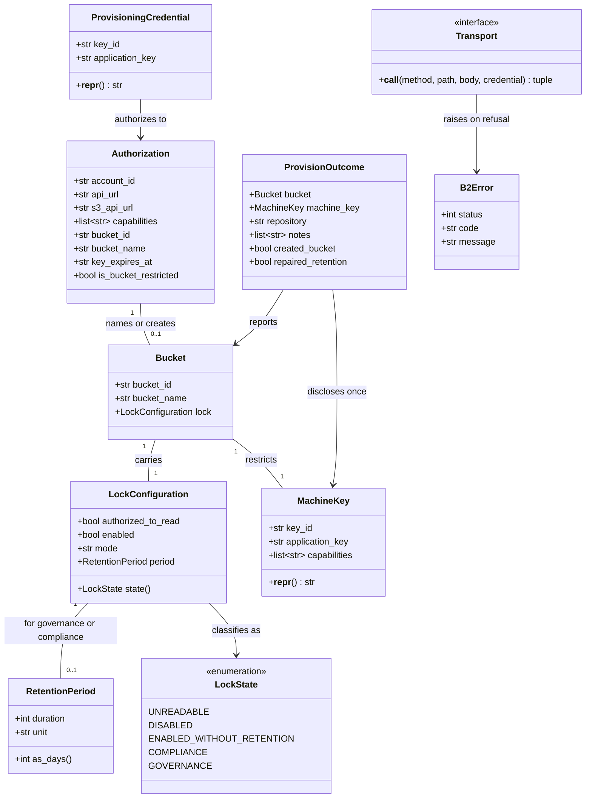

# Provision the B2 bucket and machine key from pless

## Requirements

Make the one setup step that decides whether backups can be destroyed **impossible to get
wrong**, by having `pless` create it rather than documenting clicks that produce the wrong
answer.

Backblaze's web console cannot produce the arrangement
[ADR 0017](../../adr/0017-tamper-resistance-in-the-bucket.md) depends on: its "Read and Write"
key arrives holding all 29 capabilities including `bypassGovernance` and ignores the bucket
restriction, and its create-bucket dialog offers Object Lock only in compliance mode. Both were
confirmed against a real account (#14).

`pless b2 provision` creates a bucket with Object Lock, sets a governance default retention, and
mints a machine key holding exactly the capabilities
[ADR 0020](../../adr/0020-the-machine-key-can-read-the-lock.md) specifies — operator-side, with a
credential it never stores.

**The value is not convenience.** It is that a dangerous machine key becomes *unobtainable*: B2
refuses to issue capabilities a parent key lacks, so a provisioning credential without
`bypassGovernance` cannot mint a machine key with it, even if this code is wrong
([ADR 0021](../../adr/0021-provision-the-bucket-with-a-credential-pless-never-stores.md)).

**Boundaries.** Operator-side only; nothing runs on a target and no `Host` is resolved. Nothing
in the path that takes or restores a backup learns that B2 exists — `restic_repository` stays an
opaque string. The audit checks that verify the result are specified in the backup canvas and
deliberately follow this work, so no operator is handed a CRITICAL they could only fix by hand.
Backblaze B2 is the only provider; this is not a storage abstraction.

## Entities

**Conservative notes.** No existing entity changes. `config.BackupConfig` and `config.Secrets`
are read-only here, and `provision` writes to neither: it produces the *values* an operator
places. `audit.Finding` is reused unchanged when the checks follow. `targets.Host` does not
appear at all.

`ProvisioningCredential` and `MachineKey` both override `__repr__` so a secret cannot reach a
traceback, a log line or a pasted error. This is the one place the project needs that, because
these objects exist only in memory and the leak path is output rather than argv.

## Approach

1. **Credential handling and refusal**:
   - The provisioning credential arrives on **stdin**, is used for the API calls, and is written
     nowhere — not `.env`, not `pless.toml`, not argv, not stdout. ADR 0014's rule extended to
     output, because a terminal is a transcript and transcripts get pasted into issues.
   - `provision` **refuses before acting** when the credential holds `bypassGovernance`, when it
     is bucket-restricted (it has to create a new bucket), or when it cannot be inspected at all.
     An unverifiable credential is never assumed acceptable.
   - The refusal prints the single `b2_create_key` call that mints a correct provisioning key,
     fully formed and ready to paste — no placeholders to substitute, which is where operators
     go wrong. Re-running `provision` is the verification.

2. **Technical implementation**:
   - `httpx` for transport, already a declared dependency and currently imported nowhere, so this
     sets the convention rather than following one. B2 API **v3**, parsed defensively: v3 nests
     the account information under `apiInfo.storageApi` where v2 had it at the top level.
   - **A transport seam.** Every network call goes through an injected callable, so every decision
     in this module is testable without an account. The seam is a parameter rather than a
     monkeypatched module function, because `provision` performs a *sequence* of calls whose order
     is itself a safety property worth asserting.
   - **Error rendering is a named function**, never an f-string at a call site. Errors are
     reconstructed from the HTTP status and B2's own error body; the `Authorization` header and
     the bearer token are never rendered. This is a security requirement, not a nicety.
   - The region is never configured and never typed. `b2_authorize_account` returns
     `apiInfo.storageApi.s3ApiUrl`, measured as `https://s3.eu-central-003.backblazeb2.com`, and
     `provision` assembles `s3:{s3_api_url}/{bucket}` itself.

3. **Business logic**:
   - **List before create.** `b2_list_buckets` on the name runs first. A bucket we can see is ours
     and is adopted; only then can `duplicate_bucket_name` from `b2_create_bucket` mean another
     account holds it. B2 bucket names are globally unique, so without this ordering a plausible
     name produces an error that cannot distinguish "yours" from "a stranger's".
   - **Five lock states, five answers.** Object Lock cannot be added to an existing bucket and
     cannot be disabled, while a missing default retention can be set. The adjacent states have
     opposite answers, so the classification is explicit rather than a pair of booleans.
   - **Repair the retention, refuse the mode.** A bucket with the lock on and no retention is
     `provision`'s own failure mode as much as the console's, so re-running fixes it. A
     compliance-mode bucket is refused: whether B2 permits switching the default mode is unknown,
     and a repair that half succeeds is worse than a clear no.
   - **Verify before reporting.** The lock and the retention are set by two calls, so the final
     state is read back and classified before success is claimed. A `provision` that dies between
     the calls leaves the state that looks protected and is not.
   - **Never delete a key.** A re-run reports an existing machine key and stops short of minting;
     `--new-key` mints an additional one and says plainly that the old one still works and must be
     removed by hand once the target has the new one. Deleting could break a running backup.

## Structure

### Module relationships

1. `b2.py` is a new core module: no `typer`, no `rich`, returns dataclasses, raises `B2Error`.
2. `B2Error` extends `RuntimeError`, matching `BackupError`, `DeployError` and `StorageError`.
3. `LockState` extends `StrEnum`, matching `RunOutcome`, `VerificationLevel` and `audit.Severity`.
4. `Authorization`, `Bucket`, `LockConfiguration`, `RetentionPeriod`, `MachineKey` and
   `ProvisionOutcome` are `@dataclass`.
5. `Transport` is a `Protocol`, so a test double is a plain function rather than a subclass.

### Dependencies

1. `b2.py` depends on `config` (for `version_retention_days`) and `httpx`, and on nothing else in
   the package. It imports neither `targets` nor `sshexec`: **it is the first core module that
   resolves no host.** A reviewer should treat an import of either as a mistake.
2. `cli.py` gains `b2` alongside its existing imports and registers a `b2_app` namespace.
3. `audit.py` gains nothing in this change. The credential and bucket findings are specified in
   the backup canvas and follow separately.
4. Nothing in `backup.py` changes, and nothing in it learns about B2.

### Layered architecture

1. **CLI layer** (`cli.py`): reads the credential from stdin, renders progress and the one-time
   secret disclosure, turns `B2Error` into `_fail(...)`.
2. **Orchestration** (`b2.provision`): the call sequence, the refusals, verify-before-report.
   Takes a `Transport` and an optional progress callback so it stays free of presentation.
3. **Decisions** (pure functions): name validation, credential refusal, lock classification,
   retention comparison, repository assembly, error rendering, the bootstrap call. No I/O, so
   every security-relevant judgement is testable without an account.
4. **Transport** (`b2.http_transport`): one function that performs a request and returns
   `(status, payload)`. The only part that touches the network, and the only part a test replaces.

## Operations

### Create core module — `b2.py`

1. Responsibility: everything about Backblaze B2, and nothing about hosts, SSH or restic.
2. Constants:
   - `API_URL = "https://api.backblazeb2.com"` — the fixed authorization endpoint.
   - `API_VERSION = "v3"`
   - `MACHINE_KEY_CAPABILITIES` — the six from ADR 0017 and ADR 0020, as a sorted tuple:
     `deleteFiles, listBuckets, listFiles, readBucketRetentions, readFiles, writeFiles`.
   - `FORBIDDEN_IN_PROVISIONING_KEY = ("bypassGovernance",)` — the single exclusion that makes a
     dangerous machine key unobtainable.
   - `REQUIRED_IN_PROVISIONING_KEY = ("listKeys", "writeBucketRetentions", "writeBuckets",
     "writeKeys")`

   !!! note "Corrected during verification"

       `listKeys` was missing. B2 treats listing keys as a capability distinct from creating
       them, so a credential with `writeKeys` alone can mint a key and not see one — and
       `existing_machine_keys` then got an HTTP 401 *after* the bucket had been created and its
       retention set. No fake transport could have found this: a double that answers 200 has no
       opinion about capabilities.

       The run that found it left the bucket in exactly the half-provisioned state this command
       is built to repair, which is how the adopt-and-repair path came to be verified for real.
   - `MACHINE_KEY_NAME = "pless-machine"`
   - `BUCKET_NAME_PATTERN` — B2's documented rule: 6–50 characters, lowercase letters, digits and
     hyphens, not starting or ending with a hyphen, not starting with `b2-`.

### Implement pure decisions — `b2.py`

1. `validate_bucket_name(name: str) -> None`:
   - Raises `B2Error` naming the rule that was broken, so the message says *why* rather than
     relaying B2's generic rejection. Checks length, character set, hyphen position and the
     reserved `b2-` prefix separately.
2. `parse_authorization(payload: dict) -> Authorization`:
   - Reads `apiInfo.storageApi` and falls back to a top-level `allowed` object, because v3 nests
     what v2 did not. Missing `authorizationToken` raises.
   - Carries `account_id`, `api_url`, `s3_api_url`, `capabilities`, `bucket_id`, `bucket_name` and
     `key_expires_at` from `applicationKeyExpirationTimestamp`.
   - `is_bucket_restricted` is true when `bucket_id` is present.
3. `parse_lock_configuration(payload: dict) -> LockConfiguration`:
   - Reads `fileLockConfiguration`. `isClientAuthorizedToRead: false` yields
     `authorized_to_read=False` and nothing else — the value is withheld, not absent, and the two
     must not be conflated.
   - `defaultRetention.period` is an object: `{"duration": 90, "unit": "days"}`. Both fields are
     carried; neither is converted on parse.
4. `LockConfiguration.state() -> LockState`: the five-way classification, in this order —
   `UNREADABLE`, `DISABLED`, `ENABLED_WITHOUT_RETENTION`, `COMPLIANCE`, `GOVERNANCE`.
5. `RetentionPeriod.as_days() -> int`:
   - Converts only from units it recognises, and raises `B2Error` on any other. Assuming days
     would silently pass a bucket configured in another unit, which is the mistake this exists to
     catch.
6. `refuse_provisioning_credential(auth: Authorization) -> None`:
   - Raises when any of `FORBIDDEN_IN_PROVISIONING_KEY` is present. The message says that B2
     cannot be asked to withhold what the parent key holds, and prints
     `bootstrap_key_command(auth.account_id)`.
   - Raises when the credential is bucket-restricted: it cannot create a bucket, and failing at
     `b2_create_bucket` instead would be late and obscure.
   - Raises when any of `REQUIRED_IN_PROVISIONING_KEY` is missing, naming which.
7. `bootstrap_key_command(account_id: str) -> str`:
   - The finished call that mints a correct provisioning key, ready to paste, with the account id
     filled in and nothing for a reader to substitute.

   !!! note "Corrected during verification"

       The first version used shell builtins to prompt: `read -r -s -p 'B2 master keyID: '`.
       That is **bash** syntax. In zsh — the default shell on macOS, and the one this was pasted
       into — `read -p` means "read from a coprocess", so the prompts never fired, the variables
       stayed empty, and the chain collapsed four commands later with `KeyError: 'apiInfo'`.
       A command whose entire purpose is to work when pasted cannot depend on which shell is
       pasting it.

       It is now a Python script, because the call already needed Python to read the JSON and
       because `getpass` prompts without any shell involvement. The heredoc feeds `cat` rather
       than `python3`, so the script runs with the terminal as its stdin — a heredoc piped
       straight into `python3 -` would make `getpass` read the script's own remaining lines.
       Both of those were found by running it, not by reading it.

       A test asserts the command contains no `read -p`.
8. `repository_for(s3_api_url: str, bucket_name: str) -> str`:
   - `s3:{s3_api_url}/{bucket_name}`, the form ADR 0017 specifies.
9. `retention_satisfies(lock: LockConfiguration, required_days: int) -> bool`:
   - True only for `GOVERNANCE` whose period, in days, is at least `required_days`.
10. `render_api_error(status: int, payload: dict | None, body: str) -> str`:
    - Builds a message from the status, B2's `code` and `message`. **Never** renders a request
      header, the bearer token or the credential. Falls back to the status and a truncated body
      when the payload is not JSON.

### Implement the transport seam — `b2.py`

1. `Transport` — a `Protocol` taking `(method, path, body, credential)` and returning
   `(status, payload)`. `path` is relative for API calls and absolute for authorization.
2. `http_transport(timeout: int = 30) -> Transport`:
   - The only function that imports and uses `httpx`. Sends the credential as HTTP Basic auth for
     authorization and the bearer token for everything else.
   - On a non-2xx status it does not raise: the status and payload are returned so the caller
     decides. That is what lets `duplicate_bucket_name` be interpreted rather than thrown.
3. `_call(transport, auth, endpoint, body) -> dict`:
   - Raises `B2Error(render_api_error(...))` on a non-2xx status, so the orchestration below reads
     as a sequence of successful steps.

### Implement orchestration — `b2.provision`

1. `authorize(credential, transport) -> Authorization`:
   - `b2_authorize_account` with Basic auth. A failure raises with the rendered error and never
     the credential.
2. `find_bucket(auth, name, transport) -> Bucket | None`:
   - `b2_list_buckets` filtered by `bucketName`. Returns `None` when the account holds no such
     bucket — which is what makes the create error unambiguous afterwards.
3. `create_bucket(auth, name, transport) -> Bucket`:
   - `b2_create_bucket` with `bucketType: allPrivate` and `fileLockEnabled: true`. Object Lock
     cannot be added later, so it goes on at creation.
   - `duplicate_bucket_name` here means **another account** holds the name, because `find_bucket`
     already established this account does not. The message says so and asks for a different
     name, rather than suggesting a rename of something the operator owns.
4. `set_governance_retention(auth, bucket, days, transport) -> Bucket`:
   - `b2_update_bucket` with `defaultRetention: {mode: "governance", period: {duration: days,
     unit: "days"}}`. Governance, not compliance: the console offers only the latter, and
     compliance binds the operator as much as an attacker.
5. `count_objects(auth, bucket, transport) -> int`:
   - `b2_list_file_versions` with `maxFileCount: 1`, used only to decide whether a note about
     already-written objects is warranted. Not a full enumeration.
6. `existing_machine_keys(auth, bucket, transport) -> list[str]`:
   - `b2_list_keys`, filtered to keys restricted to this bucket. Returns their ids.
7. `mint_machine_key(auth, bucket, transport) -> MachineKey`:
   - `b2_create_key` with `bucketId`, `keyName = MACHINE_KEY_NAME` and exactly
     `MACHINE_KEY_CAPABILITIES`. **No `validDurationInSeconds`**: an expiring machine key makes
     backups fail on a day nobody chose, quietly, because a failing timer is quiet.
   - Verifies the returned capability list against `MACHINE_KEY_CAPABILITIES` and raises on any
     difference, rather than trusting that the request was honoured.
8. `provision(credential, bucket_name, retention_days, transport, allow_new_key=False,
   progress=None) -> ProvisionOutcome`:
   - Logic, in order:
     - `validate_bucket_name` — before any network call, so a bad name costs nothing.
     - `authorize`, then `refuse_provisioning_credential`. Nothing is created before the
       credential has been inspected and accepted.
     - `find_bucket`. If absent, `create_bucket` and record `created_bucket=True`.
     - Classify the lock. `DISABLED` raises: Object Lock cannot be added to an existing bucket, so
       this one can never be made safe and a different bucket is needed. `COMPLIANCE` raises, with
       the note that an empty bucket costs nothing to delete.
     - `ENABLED_WITHOUT_RETENTION`, or `GOVERNANCE` with too short a period, →
       `set_governance_retention` and record `repaired_retention=True`.
     - `existing_machine_keys`. Non-empty and not `allow_new_key` → raise, naming the key ids and
       `--new-key`. Non-empty with `allow_new_key` → add a note that the old keys still work and
       must be deleted by hand once the target has the new one.
     - `mint_machine_key`.
     - **Re-read the bucket and classify again.** Success is claimed only when
       `retention_satisfies` holds on the state actually read back.
     - On an adopted bucket holding objects, add a note that a default retention applies only to
       objects written after it is set, so what is already there is not covered.
   - Errors: any step raises `B2Error`; nothing is rolled back, because a bucket with Object Lock
     and no retention is repairable by re-running and a deletion attempt would be worse.
9. Constraints: never deletes a bucket or a key; never writes a file; the credential appears in no
   return value, no log and no error.

### Create the CLI surface — `cli.py`

1. New `b2_app = typer.Typer(help="Backblaze B2 setup. Optional, and only for obtaining a bucket.",
   no_args_is_help=True)`, registered as `app.add_typer(b2_app, name="b2")`.
2. `pless b2 provision --bucket NAME [--new-key]`:
   - Reads the provisioning key id and application key with `typer.prompt(..., hide_input=True)`,
     so neither reaches argv or shell history.
   - Prints what is about to happen, naming the bucket and the retention period from
     `[backup] version_retention_days`.
   - Calls `b2.provision` with `b2.http_transport()` and a progress callback that prints each
     step.
   - On success prints, in this order: the bucket and that Object Lock is on in governance mode
     with its period; the `restic_repository` line to copy into `pless.toml`; and the machine key
     **once**, as loudly as `storage init --generate` prints the LUKS passphrase, with the warning
     that `pless` keeps no copy.
   - Prints each note from the outcome as a `[yellow]•[/yellow]` line.
   - Ends with `Next: pless backup init`.
   - Turns `B2Error` into `_fail(...)`.

### Update documentation

1. `docs/reference/commands.md` — a `## Backblaze B2` section with
   `### \`pless b2 provision --bucket NAME\``, or `tests/test_docs_consistency.py` fails. It
   carries the bootstrap `b2_create_key` call verbatim, since the refusal prints the same thing.
2. `docs/reference/secrets.md` — the provisioning credential as a secret that is deliberately
   *not* in `.env`: used once on stdin, kept in a password manager, never written by `pless`.
3. `docs/reference/configuration.md` — `version_retention_days` is what `provision` sets as the
   governance period, not only what `audit` will compare against.
4. `docs/installation/*.md` — the off-site setup step points at `pless b2 provision` rather than
   at console instructions.
5. `adr/README.md` needs no change: ADR 0020 and 0021 are already registered.

### Create tests

1. `tests/test_b2.py` — the pure decisions, with no transport at all: name validation per rule,
   authorization parsing for both v3 and v2 shapes, the five lock states, unit conversion
   including a refusal for an unrecognised unit, the credential refusals, repository assembly,
   and `render_api_error` asserted **not** to contain a credential or a token.
2. `tests/test_b2_provision.py` — the sequence, against a recording transport double:
   - the happy path on a new bucket, asserting the call order and that the retention call follows
     the create call;
   - adoption of an existing bucket with the lock on and no retention, asserting the repair;
   - refusal for `DISABLED` and for `COMPLIANCE`, asserting nothing was created or minted;
   - refusal for a credential holding `bypassGovernance`, asserting **no call followed** the
     authorization;
   - refusal when authorization fails, asserting nothing proceeded on an uninspectable credential;
   - `duplicate_bucket_name` after a miss in `find_bucket`, asserting the message says another
     account holds it;
   - an existing machine key without and with `--new-key`;
   - a minted key whose returned capabilities differ from the request, asserting it raises;
   - verify-before-report: a final read showing no retention makes it raise despite every step
     having succeeded.
   - a `TestTheFakes` class holding the transport double to the `Transport` protocol signature.
3. `tests/test_cli_b2.py` — the wiring: the credential is prompted rather than taken from argv,
   the machine key is printed once, `B2Error` becomes a clean failure rather than a traceback, and
   the repository line appears exactly as `pless.toml` needs it.

## Norms

1. **Secrets on stdin, never in argv, and never in output.** ADR 0014 extended: the credential is
   prompted with `hide_input=True`, `ProvisioningCredential` and `MachineKey` override `__repr__`,
   and `render_api_error` is the only function that turns a failure into text.
2. **Core modules stay free of `typer` and `rich`.** `b2.py` returns dataclasses and raises
   `B2Error`; progress reaches the operator through a callback, as `drill.verify_full` already
   does.
3. **Pure where it can be.** Every decision that matters — which capabilities are acceptable,
   which lock state applies, whether a period is long enough — is a function over parsed data with
   no I/O, and has a test that needs no account.
4. **Fakes carry the signatures they stand in for.** The transport double is held to the
   `Transport` protocol by a test, following `tests/test_cli_preflight.py` and `tests/test_drill.py`:
   a fake with the wrong shape is a test that passes while the code breaks.
5. **Parse defensively, assume nothing observed once.** B2 v3 nests under `apiInfo.storageApi`;
   fall back to the v2 shape, and treat a missing field as missing rather than as a default.
6. **Error messages name the cause and the next step.** The refusal prints the call that fixes it;
   a duplicate name says who holds it; an unrecognised retention unit says which.
7. **Fixtures are real responses.** The payloads in tests are the ones captured on #16, not
   invented shapes. Fakes drifting from the API is a failure mode this project has already had.
8. **Documentation is part of the change.** A new command means
   `docs/reference/commands.md`, and the drift guard enforces it.

## Safeguards

1. **Functional constraints**:
   - `provision` must inspect and accept the credential **before** creating anything.
   - A credential holding `bypassGovernance` must be refused, and the refusal must print a
     working `b2_create_key` call.
   - A credential that cannot be inspected must stop the command. An unverifiable credential is
     never treated as acceptable.
   - A bucket-restricted credential must be refused up front, not at `b2_create_bucket`.
   - `b2_list_buckets` must precede `b2_create_bucket`, so `duplicate_bucket_name` can only mean
     another account holds the name.
   - Object Lock must be requested at bucket creation; a bucket found without it must be refused
     as unrepairable.
   - A compliance-mode bucket must be refused, never repaired.
   - A bucket with Object Lock and no default retention must be repaired, not refused — it is
     `provision`'s own failure mode.
   - Success must be claimed only after re-reading the bucket and confirming governance retention
     of at least `version_retention_days`.
   - A minted key's returned capabilities must equal `MACHINE_KEY_CAPABILITIES` exactly, or the
     command fails.
   - `provision` must never delete a bucket or a key, and must never write a file.
   - An existing machine key must stop the command unless `--new-key` is given.
2. **Performance constraints**:
   - At most eight API calls on the happy path: authorize, list buckets, create bucket, update
     bucket, list file versions, list keys, create key, list buckets again.
   - `count_objects` uses `maxFileCount: 1` and never enumerates a bucket.
   - HTTP timeout is explicit, defaulting to 30 seconds; no retries, because every call here
     changes state or decides whether to change state.
3. **Security constraints**:
   - The provisioning credential is never written to `.env`, `pless.toml`, argv, stdout or a log,
     and never appears in a `B2Error` message or a traceback.
   - The `Authorization` header and the bearer token are never rendered. Errors are built from the
     status code and B2's own error body.
   - The master key never reaches `pless`: there is no code path that accepts it, by design
     (ADR 0021).
   - The machine key is disclosed exactly once, on success, and `pless` keeps no copy.
   - The minted key carries no expiry.
   - `provision` never reduces an existing retention period; it only raises one that is too short.
4. **Integration constraints**:
   - `b2.py` must not import `targets`, `sshexec`, `backup` or `drill`. It resolves no host.
   - Nothing in `backup.py`, `drill.py` or `audit.py` changes in this work.
   - `restic_repository` stays an opaque string; no provider abstraction is introduced.
   - `pless b2 provision` must work with no `[host]` configured at all.
5. **Business rule constraints**:
   - The governance period comes from `[backup] version_retention_days` and nowhere else.
   - The repository string is assembled from the account's own `s3ApiUrl`; the region is never
     configured and never typed.
   - A retention period in a unit the code does not recognise fails rather than being assumed to
     be days.
6. **Error handling constraints**:
   - Every failure is a `B2Error` carrying a message that names the cause and, where one exists,
     the next step.
   - `cli.py` turns `B2Error` into `_fail(...)`; no `B2Error` reaches the operator as a traceback.
   - A non-2xx status is returned by the transport rather than raised, so the orchestration can
     interpret `duplicate_bucket_name` instead of being thrown by it.
7. **Technical constraints**:
   - B2 API v3, with the v2 response shape tolerated on parse.
   - `httpx` only inside `http_transport`; no other module imports it.
   - Python 3.12+, `StrEnum` for `LockState`, `Protocol` for `Transport`.
8. **Data constraints**:
   - Bucket names: 6–50 characters, lowercase letters, digits and hyphens, not leading or trailing
     a hyphen, not beginning `b2-`. Validated locally before any call.
   - `defaultRetention.period` is `{duration: int, unit: str}`; the unit is read before the
     duration is used.
   - `isClientAuthorizedToRead: false` means the value was withheld, which is distinct from a
     value that is absent.
9. **Verification constraints**:
   - This cannot be drilled on a disposable VM. A verification run needs a real Backblaze account
     and a throwaway bucket.
   - Until that run has happened, the work is not claimed as verified — the measurements on #16
     cover the API shapes, not this code.

   !!! note "Verified, and what it cost"

       Run against a real account on 2026-10-03. It found four faults, none of which any unit
       test could have reached, and all four are fixed:

       - `read -r -s -p` is bash; in zsh it means "read from a coprocess", so the bootstrap
         call's prompts never fired and the chain collapsed four commands later.
       - A heredoc piped into `python3 -` makes stdin the script, so `getpass` reads the
         script's own remaining lines.
       - `typer.prompt(hide_input=True)` raises `EOFError` with no controlling terminal, so the
         command was unusable from a script, from CI, and from the wizard in #8. The credential
         may now arrive on a pipe.
       - **`b2_list_keys` needs `listKeys`**, which B2 treats as distinct from `writeKeys`. The
         first run created the bucket, set its retention, and *then* failed with an HTTP 401. A
         transport double that answers 200 has no opinion about capabilities, so all 530 tests
         passed throughout.

       The fourth left the bucket created, locked and retained with no machine key — this
       command's own half-provisioned failure mode — which is how the adopt-and-repair path came
       to be verified against an accident rather than a fixture.

       **Cleanup needs the master key or the console.** The provisioning credential holds
       neither `deleteKeys` nor `deleteBuckets`, because ADR 0017 names both as capabilities a
       key must not have. So `provision` creates things it cannot itself remove. That is the
       design working, and the documentation should say so rather than let an operator discover
       it while tidying up.

       Not exercised against a live credential: the `bypassGovernance` refusal, which would
       require handing the master key to the command — the one thing ADR 0021 forbids. It is
       covered by unit tests over a real-shaped payload, and by the account-wide credential
       refusal, which did fire against a live bucket-restricted key.
