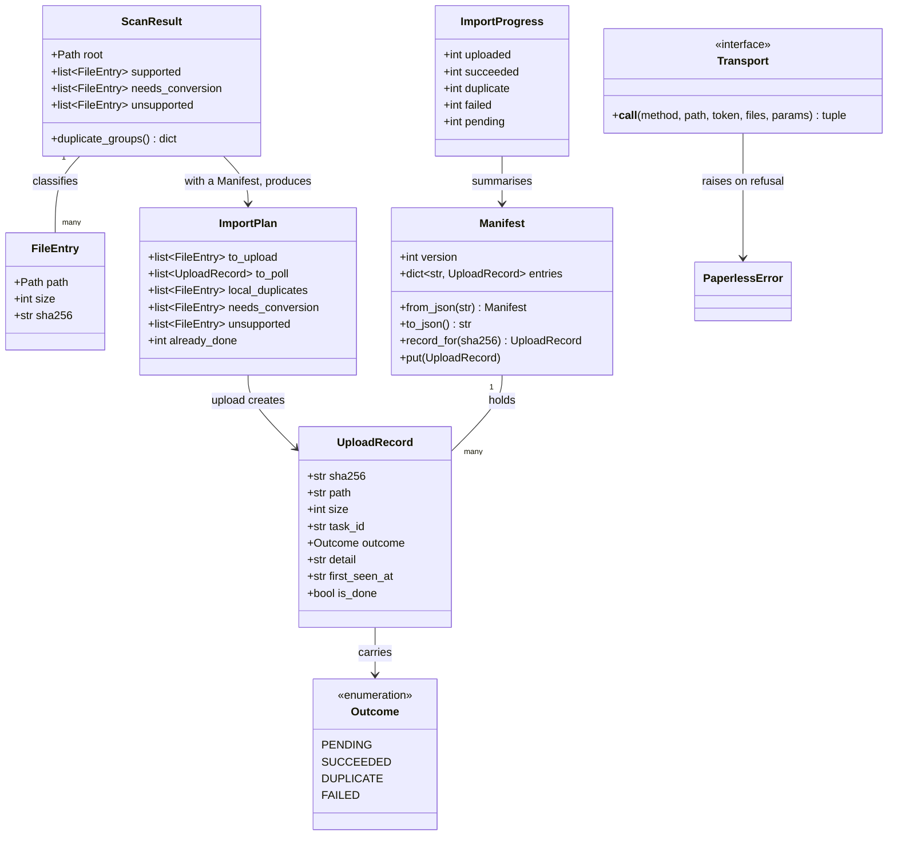

# Import documents through the Paperless REST API

## Requirements

Get an operator's existing documents into the archive, and be honest about where each one got to.

Without import there is no archive, which makes this the blocking feature. The hard part is not
the upload: it is that **uploading a file is not the same as the archive containing it**. Paperless
accepts a file, queues it, OCRs it, and may reject it as a duplicate or fail to parse it — minutes
or hours later. A tool that reports the upload as success is lying about the only thing the
operator cares about.

So the deliverable is an import that **survives being interrupted, re-entered, and run again
tomorrow**, and that can say per file whether it is in the archive, still being worked on, already
there, or never going to make it.

**Boundaries.** Local files are read and never written, moved or deleted. Outcomes come from
Paperless and are never inferred ([ADR 0012](../../adr/0012-import-through-the-rest-api.md)). The
API is reached over Tailscale, as that record assumes. No rsync bulk path: the issue and the ADR
both say measure first, and the thing to measure is whether the uplink or the OCR is the
bottleneck.

## Entities

**Conservative notes.** `docscan.FileEntry`, `ScanResult` and `duplicate_groups()` are reused
unchanged — `pless docs scan --hashes` already produces exactly the classification an import
needs, including local duplicate groups. `config.PathsConfig.documents` is the default path.
Nothing in `docscan` changes.

`UploadRecord` is keyed by `sha256` rather than by path, so a file the operator later moves or
renames is still recognised as done. `path` is carried for the operator's benefit, not as identity.

## Approach

1. **Reachability and credentials**:
   - The API is reached **over Tailscale**, as ADR 0012 assumes. Not over an SSH tunnel: after
     `pless harden` the operator is on the tailnet by necessity, since
     [ADR 0004](../../adr/0004-access-through-tailscale-only.md) makes it the only way in and SSH
     goes the same route. The precondition exists only before `pless tailscale up`, which is a
     documented step of the install flow.
   - **The target is asked what it is called.** `tailscale.status(target)` already returns the
     machine's own DNS name over SSH, so there is no parsing of `[host]` and it works whether
     `[host]` is an address or an `ssh_config` alias. A target whose Tailscale is not up fails with
     a message naming `pless tailscale up`.
   - The token is **read, not fetched**: `PAPERLESS_API_TOKEN` from `config.Secrets`, with a
     refusal that says where to create one when it is absent. Whether `pless` should obtain one
     itself, and where secrets live at all, is [#7](https://github.com/kschulst/pless/issues/7) —
     import must not care.

2. **Technical implementation**:
   - A new core module `paperless.py`: no `typer`, no `rich`, dataclasses out, `PaperlessError`
     in. `httpx` behind an **injected transport**, as `b2.py` does, so every decision is testable
     without a running Paperless.
   - Multipart upload to `POST /api/documents/post_document/`; outcome from
     `GET /api/tasks/?task_id=<id>`. **The response shape of both is version-dependent and must be
     verified against the pinned `[paperless] version` before the code trusts it** — assuming it
     is the mistake the B2 work made twice.
   - Errors are rendered by one named function that never includes the token, following the same
     rule `b2.render_api_error` follows for the same reason: a pasted error is the realistic leak.

3. **Business logic**:
   - **The manifest is the source of truth, not the process.** `upload` plans from
     `ScanResult + Manifest`, acts, and writes after every change. An import that is killed loses
     at most the uploads in flight.
   - **One command, run as often as you like.** `pless docs upload` offers what is not done, polls
     what is pending, and stops when there is nothing left to do *right now* — not when the import
     is finished. Running it again is both "resume" and "check on it", which is one command and
     one concept instead of two.
   - **A duplicate is done.** Paperless rejecting a document it already holds means the archive
     contains it. Recording it as a failure would make every re-run look worse than the last.
   - **A failure is remembered and not retried.** A corrupt file fails forever; retrying it every
     run turns the one thing worth looking at into noise. `--retry-failed` offers them again, so
     the operator asks rather than is asked.
   - **Local duplicates are uploaded once.** `duplicate_groups()` already finds them, and sending
     both wastes an upload and an OCR to be told what `scan` already knew.
   - **Uploading does not outrun consumption.** A small batch, because Paperless OCRs serially and
     a large one buys only a longer queue and a worse interruption.

4. **The interaction with backup** — a change to `backup`, not to import:
   - The rendered backup script currently writes a **failed** record and exits non-zero when the
     task queue does not drain within `quiescence_timeout_seconds`. During a multi-day import the
     queue never drains, so every nightly run fails with a record saying the export was not
     attempted.
   - A busy queue becomes a **skip**, in exactly the shape the locked volume already has:
     `EXIT_SKIPPED`, which the unit treats as success, and a calm message. A normal state must not
     train the operator to ignore backup alerts — the reasoning the existing skip already rests on.
   - **With a boundary**, or a queue stuck for an unrelated reason becomes permanently invisible.
     The run record counts consecutive busy skips; past `[backup] max_busy_skips` it is a failure
     again, with a message saying the queue has been busy for that many runs and naming
     `pless backup status`.

## Structure

### Module relationships

1. `paperless.py` is a new core module: no `typer`, no `rich`, returns dataclasses, raises
   `PaperlessError`.
2. `PaperlessError` extends `RuntimeError`, matching `BackupError`, `DeployError`, `StorageError`
   and `B2Error`.
3. `Outcome` extends `StrEnum`, matching `RunOutcome`, `LockState` and `audit.Severity`.
4. `UploadRecord`, `Manifest`, `ImportPlan` and `ImportProgress` are `@dataclass`.
5. `Transport` is a `Protocol`, so a test double is a function rather than a subclass.

### Dependencies

1. `paperless.py` depends on `config`, `docscan`, `composegen` (for `WEB_PORT`) and `httpx`.
   Unlike `b2.py` it **does** need a host — but only to ask Tailscale for a name, so it takes
   `tailscale.status`'s result rather than a `Host`: the HTTP layer never learns what SSH is.
2. `cli.py` gains `paperless` and a `docs upload` command beside the existing `scan` and
   `estimate`.
3. `backup.py` changes only in the rendered script and the run record — a new outcome and a skip
   counter. Nothing in it learns what an import is.
4. `docscan.py` does not change at all.

### Layered architecture

1. **CLI layer** (`cli.py`): resolves the host, reads the token, renders progress and the summary,
   turns `PaperlessError` into `_fail(...)`.
2. **Orchestration** (`paperless.run_import`): plan, upload, poll, persist. Takes a `Transport` and
   a progress callback, so it stays free of presentation.
3. **Decisions** (pure): planning an import from a scan and a manifest, classifying a task
   response, deciding what a re-run offers. No I/O, so the behaviour that matters is testable
   without a Paperless.
4. **Transport** (`paperless.http_transport`): one function that performs a request and returns
   `(status, payload)`. The only part that touches the network.
5. **Persistence** (`paperless.Manifest`): JSON beside `pless.toml`, written atomically.

## Operations

### Create core module — `paperless.py`

1. Constants:
   - `API_ROOT = "/api"`, `UPLOAD_PATH = "/api/documents/post_document/"`,
     `TASKS_PATH = "/api/tasks/"`.
   - `MANIFEST_NAME = "pless-import.json"` — beside `pless.toml`.
   - `MANIFEST_VERSION = 1`, so a future change can migrate rather than guess.
   - `DEFAULT_BATCH = 4` — Paperless consumes serially; this bounds what an interruption loses.
   - `POLL_INTERVAL_SECONDS = 10`, `DEFAULT_POLL_BUDGET_SECONDS = 300` — how long one invocation
     waits before leaving the rest in the manifest.

### Implement pure decisions — `paperless.py`

1. `base_url(tailscale_hostname: str) -> str`:
   - `http://<hostname>:<composegen.WEB_PORT>`. Raises `PaperlessError` naming
     `pless tailscale up` when the hostname is empty.
2. `manifest_path(config_file: Path | None) -> Path`:
   - Beside `pless.toml` when there is one, otherwise the working directory.
3. `Manifest.from_json` / `to_json`:
   - A missing file is an empty manifest; **malformed JSON raises** rather than being treated as
     empty, because silently starting over would re-upload an entire archive.
   - An unknown `version` raises with a message naming the version it found.
4. `UploadRecord.is_done` → `outcome in (SUCCEEDED, DUPLICATE)`.
5. `classify_task(payload: dict) -> tuple[Outcome, str]`:
   - Reads Paperless's task representation: `status` (`SUCCESS`, `FAILURE`, `PENDING`, `STARTED`)
     and `result`.
   - A `FAILURE` whose result mentions an existing document is `DUPLICATE`, not `FAILED` — the
     archive contains the document, which is what the operator asked for.
   - An unrecognised status is `PENDING`, never a success. Silence is not consumption.
6. `plan_import(scan: ScanResult, manifest: Manifest, retry_failed: bool = False) -> ImportPlan`:
   - `to_upload`: supported files whose record is absent, or `FAILED` with `retry_failed`.
   - `to_poll`: records with `PENDING`.
   - `local_duplicates`: for each group in `scan.duplicate_groups()`, every entry after the first.
     Uploaded once; the rest are recorded against the same hash and need no upload at all.
   - `needs_conversion` and `unsupported` pass through from the scan, reported and skipped.
   - `already_done`: records that are `is_done`.
   - Pure, and the single place that decides what a run does.
7. `summarise(manifest: Manifest) -> ImportProgress`: counts per outcome.
8. `render_api_error(status: int, payload: dict | None, body: str = "") -> str`:
   - From the status and Paperless's own detail. **Never** the token or a request header.

### Implement the transport seam — `paperless.py`

1. `Transport` — a `Protocol` taking `(method, url, token, files, params)` and returning
   `(status, payload)`.
2. `http_transport(timeout: int = 120) -> Transport`:
   - The only function that imports `httpx`. Sends `Authorization: Token <token>`.
   - A non-2xx status is returned, not raised, so a 409-style duplicate can be read rather than
     thrown.
   - The upload timeout is generous: a large PDF over a domestic uplink is slow.

### Implement orchestration — `paperless.run_import`

1. `resolve_base_url(target, tailscale_status) -> str`: `base_url` of the status's hostname, with
   the refusal when Tailscale is not up.
2. `upload_file(base, token, entry, transport) -> str`:
   - Multipart `POST`, returns the task id. A response carrying no task id raises, because a file
     whose task is unknown can never be followed up.
3. `poll_task(base, token, task_id, transport) -> tuple[Outcome, str]`:
   - A task id Paperless no longer knows is `PENDING` with a detail saying so, **not** `FAILED`:
     Paperless prunes its task list, and re-uploading on that basis would duplicate a document
     already in the archive.
4. `run_import(cfg, token, base, scan, manifest, transport, batch, poll_budget, retry_failed,
   progress) -> ImportProgress`:
   - Logic, in order:
     - `plan_import`.
     - Record every `local_duplicate` against its group's hash with the outcome of that hash, so
       the summary accounts for them without an upload.
     - Upload in batches of `batch`, writing the manifest after **each** upload, so an interruption
       loses at most one file's knowledge.
     - Poll `to_poll` plus the newly uploaded, in rounds of `POLL_INTERVAL_SECONDS`, until
       everything is done or `poll_budget` is spent. Write the manifest after each round.
     - Return `summarise(manifest)`.
   - Constraints: never writes, moves or deletes a local file; never deletes a manifest entry;
     the token appears in no return value, no log and no error.
5. `plan_only(scan, manifest, retry_failed) -> ImportPlan` for `--dry-run`, which performs no
   request at all.

### Change the backup quiescence outcome — `backup.py`

1. `RunOutcome` gains `SKIPPED_BUSY = "skipped-busy"`.
2. `BackupRun` gains `busy_skips: int = 0`, carried through `from_json`/`to_json`.
3. `config.BackupConfig` gains `max_busy_skips: int = 7` — how many consecutive busy skips are
   tolerated before a failure. Documented in `pless.toml` and the configuration reference.
4. `render_script` — the quiescence branch, which currently writes `failed` and exits 1:
   - Read the previous record's `busy_skips`, add one.
   - Below `max_busy_skips`: write `skipped-busy` with that count and a detail saying the queue was
     busy and an import is the usual reason, then exit `EXIT_SKIPPED`, which the unit already
     treats as success.
   - At or above it: write `failed` naming the number of runs and pointing at
     `pless backup status`, then exit 1.
   - A successful run resets the counter to zero.
5. `backup.run` maps `EXIT_SKIPPED` to the record it finds rather than assuming the locked-volume
   case, since there are now two reasons for that exit code.
6. `cli.backup_run` prints a busy skip calmly, naming the count, and distinguishes it from the
   locked-volume skip.
7. `cli.backup_status` shows a busy-skip run as a skip, not a failure.

### Create the CLI surface — `cli.py`

1. `pless docs upload [PATH] [--dry-run] [--retry-failed] [--batch N] [--json]`:
   - `PATH` defaults to `[paths] local_documents`.
   - Scans with hashes — required, since the manifest is keyed by content.
   - `--dry-run` prints the plan and makes no request.
   - Prints a running count of uploaded and consumed **separately**, because they diverge by hours
     and a single number would imply they do not.
   - On finishing, prints the summary: in the archive, already there, still being worked on,
     failed — plus the counts for needs-conversion and unsupported, so nothing is silently
     dropped.
   - When anything is still pending, says so and that running the command again collects the rest.
   - `--json` prints the manifest summary, for a future web layer.
   - Turns `PaperlessError` into `_fail(...)`.

### Update documentation

1. `docs/reference/commands.md` — `### \`pless docs upload\``, or the drift guard fails. Says that
   uploaded is not consumed, that re-running is how you resume and how you check, and that it needs
   Tailscale up.
2. `docs/reference/configuration.md` — `max_busy_skips`, and the `[paths] local_documents` default
   in the context of import.
3. `docs/cookbook/` — a page on importing a collection: what to expect of throughput, why the
   first run does not finish, and what a failed document means.
4. `docs/cookbook/backup.md` — the busy-skip state, since an operator importing for days will see
   it in `pless backup status`.
5. The "Not built yet" list loses `pless docs upload`.

### Create tests

1. `tests/test_paperless.py` — the pure decisions with no transport: task classification for every
   status Paperless reports including the duplicate-as-failure shape, manifest round-trips,
   malformed and unknown-version manifests raising, `plan_import` for each case (absent, pending,
   done, failed with and without `--retry-failed`, local duplicates), and `render_api_error`
   asserted **not** to contain the token.
2. `tests/test_paperless_import.py` — the sequence against a recording transport: the manifest
   written after every upload, an interruption losing at most one file, a re-run offering only what
   is not done, a pending task collected on a later run, a task id Paperless has forgotten staying
   pending rather than becoming failed, local duplicates uploaded once, and `--dry-run` making no
   request. A `TestTheFakes` class holding the double to the `Transport` protocol.
3. `tests/test_cli_docs_upload.py` — the wiring: the default path, the token refusal naming where
   to create one, the Tailscale refusal naming `pless tailscale up`, uploaded and consumed reported
   separately, and `PaperlessError` arriving as a message rather than a traceback.
4. `tests/test_backup.py` — the busy-skip branch of the rendered script: that it exits
   `EXIT_SKIPPED` below the threshold and 1 at it, that the counter increments and resets, and that
   `sh -n` still accepts the script.

## Norms

1. **Secrets never reach argv or output.** The token comes from `config.Secrets`, is sent in a
   header, and `render_api_error` is the only path from a failure to text.
2. **Core modules stay free of `typer` and `rich`.** `paperless.py` returns dataclasses and raises
   `PaperlessError`; progress reaches the operator through a callback, as `drill` and `b2` do.
3. **Pure where it can be.** Planning, classification and summarising are functions over parsed
   data, each with a test that needs no Paperless.
4. **Fakes carry the signatures they stand in for**, held by a `TestTheFakes` class, following
   `test_drill.py`, `test_b2_provision.py` and `test_cli_preflight.py`.
5. **Verify response shapes against the pinned version.** `[paperless] version` is exact for a
   reason. The task representation and the upload response must be confirmed against it, not
   assumed — the B2 work was bitten twice by inference.
6. **Silence is never success.** An unknown task status is pending; a forgotten task is pending; a
   malformed manifest raises. Every ambiguous answer resolves to "not done".
7. **The manifest is written atomically** — a temporary file and a rename — because a half-written
   manifest is worse than none.
8. **Documentation is part of the change**, enforced by the drift guard for commands and config.

## Safeguards

1. **Functional constraints**:
   - A local file is never written, moved or deleted. Import only reads.
   - An outcome is never inferred. It comes from Paperless's task representation or it is pending.
   - A duplicate is recorded as done, never as a failure.
   - A failed file is not retried unless `--retry-failed` is given.
   - A task id Paperless no longer knows stays pending; it never becomes failed, because
     re-uploading on that basis duplicates a document already in the archive.
   - `--dry-run` performs no HTTP request at all.
   - The manifest is written after every upload and every poll round.
   - A malformed manifest stops the command; it is never treated as empty.
   - Local duplicates are uploaded once.
   - Files needing conversion and unsupported files are counted in the summary, never silently
     dropped.
2. **Performance constraints**:
   - At most `batch` uploads in flight, defaulting to 4.
   - One invocation polls for at most `poll_budget` seconds, defaulting to 300, and then leaves the
     rest in the manifest. It does not wait for an import to finish, because an import takes days.
   - Task polling is batched by task id rather than one request per document per round.
   - The upload timeout is per file and generous; the poll timeout is short.
3. **Security constraints**:
   - The API token appears in no argv, no log, no error message and no `__repr__`.
   - The manifest contains paths, sizes, hashes and task ids — and no secret.
   - Nothing is sent anywhere except the target's Paperless.
4. **Integration constraints**:
   - `paperless.py` must not import `targets` or `sshexec`: it receives a resolved hostname, so the
     HTTP layer never learns what SSH is.
   - `docscan.py` does not change.
   - `backup.py` changes only in the rendered script, the run record and the outcome enum. Nothing
     in it learns what an import is.
   - `pless docs upload` requires Tailscale up and says so by name when it is not.
5. **Business rule constraints**:
   - The manifest is keyed by `sha256`, so a moved or renamed file is still recognised as done.
   - A modified file is a new file, and is offered again.
   - Both a value and a `*_COMMAND` for the same secret is out of scope here; see #7.
6. **Error handling constraints**:
   - Every failure is a `PaperlessError` whose message names the cause and, where one exists, the
     next step.
   - `cli.py` turns `PaperlessError` into `_fail(...)`; none reaches the operator as a traceback.
   - A non-2xx status is returned by the transport so the orchestration can interpret it.
7. **Technical constraints**:
   - `httpx` only inside `http_transport`.
   - Python 3.12+, `StrEnum` for `Outcome`, `Protocol` for `Transport`.
   - Paperless API paths are constants, and the response shapes are verified against
     `[paperless] version` before being relied on.
8. **Data constraints**:
   - The manifest carries `version`, and an unknown one raises rather than being read optimistically.
   - Timestamps are ISO-8601 UTC, as the backup records are.
   - `busy_skips` resets to zero on a successful backup run.
9. **Verification constraints**:
   - A drill needs a corpus with duplicates, a deliberately corrupt file, and enough volume to see
     throughput — so it takes hours rather than minutes, and must run on a real target with
     Paperless deployed.
   - It must confirm the two things only reality can: the shape of the upload response and of the
     task representation at the pinned Paperless version.
   - It must also confirm the backup interaction — that a nightly run during an import skips
     calmly, and that the counter eventually turns it into a failure.
   - Throughput measured there is what decides whether the rsync bulk path in
     [#1](https://github.com/kschulst/pless/issues/1) is worth anything. If OCR is the bottleneck,
     it is not.
