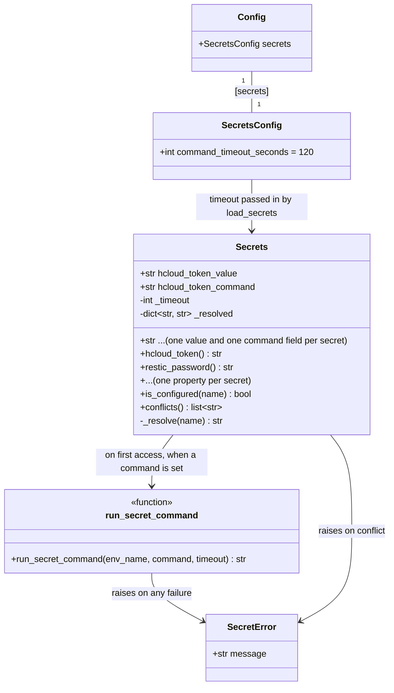

# Resolve secrets through a command

## Requirements

Let an operator keep every secret `pless` reads in a password manager instead of in `.env`, by
naming a command that prints the secret rather than the secret itself
([#37](https://github.com/kschulst/pless/issues/37),
[ADR 0022](../../adr/0022-secrets-resolve-through-a-command-not-an-integration.md)).

For every secret `X`, `.env` or the process environment may hold `X_COMMAND` instead of `X`.
`pless` runs that command when the secret is first needed and uses what it prints. `.env` then
holds coordinates such as `security find-generic-password -s pless-restic -w`, which are not
secret.

**Boundaries.**

- Resolution happens on the operator's machine. Files `pless` renders for the target
  (`/opt/paperless/.env`, `backup.env`) still receive resolved values, because Paperless and
  restic on the target read files.
- `pless` knows nothing about any vault. It runs a command and reads stdout.
- Writing secrets into a vault is [#7](https://github.com/kschulst/pless/issues/7) and is out of
  scope.
- The LUKS passphrase is not one of the nine secrets and is unaffected.

Decisions taken before this canvas are recorded on
[#37](https://github.com/kschulst/pless/issues/37#issuecomment-5982432428): lazy resolution,
`sh -c`, a configurable timeout, "set" meaning non-empty, and `init --secrets` skipping a key that
has a command. The analysis is
[`spdd/analysis/004-…`](../analysis/004-20261004-[Analysis]-secrets-into-and-out-of-a-password-manager.md).

## Entities



**Conservative notes.**

- `Secrets` stays a `pydantic_settings.BaseSettings` reading `.env` and the process environment.
  No new class replaces it.
- The nine public attribute names (`restic_password`, `paperless_api_token`, …) are unchanged, so
  `backup.py`, `composegen.py`, `deploy.py`, `drill.py`, `tailscale` and `cli.py` read secrets
  exactly as they do now. They become read-only properties.
- The stored value moves to a field named `<name>_value` with `validation_alias="<name>"`.
  pydantic-settings matches environment names case-insensitively, so the field is still filled from
  `RESTIC_PASSWORD`, and `Secrets(restic_password="x")` still works as a constructor keyword. The
  existing tests construct `Secrets` that way in eight places.

  !!! note "Verified before writing this canvas"

      A prototype against pydantic 2.13.4 and pydantic-settings 2.14.2 confirmed: the aliased
      field is filled from `.env`, from the process environment and from a constructor keyword;
      `X_COMMAND` is read from both `.env` and the process environment; an empty `X=` beside
      `X_COMMAND` leaves the value field empty; and a cached property runs the command once
      across repeated reads.

## Approach

1. **Where the mechanism lives**:
   - Entirely in `config.py`. `config.Secrets` gains the command fields, the properties and the
     resolver. ADR 0022: "`config.Secrets` gains a resolution step; no other module changes."
   - One exception: `cli.py` must report `SecretError`, and three call sites need small changes
     (below). No core module other than `config` changes.

2. **Resolution**:
   - **Lazy, cached per process.** A property resolves its secret on first read and stores the
     result in a private dict. A `pless` command that never reads `RESTIC_PASSWORD` never runs
     `RESTIC_PASSWORD_COMMAND`, so the operator sees no keyring prompt for it.
   - **`/bin/sh -c <command>`.** The string comes verbatim from the operator's own `.env`, and
     nothing from `pless` is interpolated into it, so a shell adds no attack surface: whoever can
     write `.env` can already run anything. With a shell, a command behaves the same in `.env` as
     pasted into a terminal, including `~`, quoting and pipes such as `pass show x | head -1`.
   - **I/O.** stdout is captured. stderr is inherited, so the command's own messages and prompts
     reach the terminal. stdin is inherited **only when `pless`'s own stdin is a TTY**, and is
     `/dev/null` otherwise. `pless b2 provision` reads a credential from piped stdin; a secret
     command that also read stdin would consume it. Interactive prompts (`op` without desktop
     integration reads a password from stdin) still work in a terminal.
   - **Timeout.** `[secrets] command_timeout_seconds`, default 120. Long enough for a human to
     answer a keyring or Touch ID prompt; bounded so a command waiting on something that will
     never come does not hang `pless` indefinitely.
   - **Output.** Decoded as UTF-8. One trailing `\n` (or `\r\n`) is removed and nothing else, so a
     secret that legitimately ends in a space is kept.

3. **Errors** (ADR 0022 consequences, made concrete):
   - **Conflict.** `X` and `X_COMMAND` both non-empty is an error naming both keys. Checked in
     `load_secrets`, before any command runs, for all nine secrets: a misconfigured `.env` is
     reported on every command rather than only on the one that reads that secret.
   - **Failure is fatal, never an empty secret.** Non-zero exit, timeout, a command that cannot be
     started, empty output after stripping, output that is not UTF-8, and output with more than
     one line are each a `SecretError`. More than one line matters beyond correctness:
     `composegen.render_server_env` writes `KEY=value` lines, and a value containing a newline
     would add lines to the server-side `.env`.
   - **What an error may contain.** The environment name (`RESTIC_PASSWORD_COMMAND`), the
     command string, the exit code or timeout, and the line count. Never stdout. stderr is not
     captured, so it is already on the terminal and is not repeated.
   - **Reporting.** `SecretError` can be raised from inside a core module, for example while
     `backup.install` renders `backup.env`. `cli.py` gets a `main()` entry point that runs `app`
     and turns `SecretError` into the same red one-line message `_fail` prints, with exit code 1.
     `pyproject.toml`'s script entry moves from `pless.cli:app` to `pless.cli:main`.

4. **Callers that need more than the property**:
   - **`pless doctor`** reads `sec.paperless_admin_password` to decide whether secrets were
     generated. With a command set, that would run the command during a health check. It switches
     to `sec.is_configured("paperless_admin_password")`, which is true when either the value or
     the command is non-empty and runs nothing. `doctor` also reports conflicts as a failed check
     rather than crashing, which needs `load_secrets` to be bypassed there: it constructs `Secrets`
     via a `load_secrets(..., check=False)` and calls `conflicts()` itself.
   - **`pless init --secrets`** fills `X=` only when `X_COMMAND` is not set in `.env`. Without
     this, it would write a value beside the command and the next run would fail with the
     conflict error.
   - **`pless hetzner check-token`** calls `hetzner.make_client(sec.hcloud_token)` inside
     `except Exception`. A `SecretError` there would be reported as a Hetzner failure. The token is
     read into a local variable before the `try`.

## Structure

### Inheritance relationships

1. `SecretError` extends `RuntimeError`, matching `BackupError`, `DeployError`, `StorageError`,
   `B2Error` and `PaperlessError`.
2. `Secrets` extends `pydantic_settings.BaseSettings`, as now.
3. `SecretsConfig` extends `pydantic.BaseModel`, matching the other `*Config` sections.

### Dependencies

1. `config.py` gains `subprocess`, `sys` and `os` from the standard library. No new package.
2. `cli.py` calls `config.load_secrets(cfg.secrets)` instead of `config.load_secrets()` at its
   seven call sites, and catches `config.SecretError` in `main()`.
3. `backup.py`, `composegen.py`, `deploy.py`, `drill.py`, `paperless.py`, `hetzner.py` and
   `tailscale.py` do not change.

### Layered architecture

1. **CLI layer** (`cli.py`): loads config and secrets, reports `SecretError` once in `main()`,
   adjusts `doctor`, `init --secrets` and `hetzner check-token`.
2. **Configuration layer** (`config.py`): reads values and commands, detects conflicts, resolves
   lazily, raises `SecretError`.
3. **Process seam** (`config.run_secret_command`): the only function that starts a subprocess for
   a secret. Tests replace it by monkeypatching or by pointing a command at a three-line script.

## Operations

### Add configuration — `config.SecretsConfig`

1. `SecretsConfig(BaseModel)`:
   - `command_timeout_seconds: int = Field(120, ge=1)`.
2. `Config` gains `secrets: SecretsConfig = SecretsConfig()`.
3. `src/pless/templates/pless.toml` and the repository's `pless.toml` gain:

   ```toml
   [secrets]
   # How long a *_COMMAND in .env may take to print its secret, including the time
   # you need to answer a keyring or Touch ID prompt. Vault paths do not go here:
   # they belong in .env, beside the secret they replace.
   command_timeout_seconds = 120
   ```

### Create the error — `config.SecretError`

1. `class SecretError(RuntimeError)`, message only, like the other domain errors.

### Create the process seam — `config.run_secret_command`

1. Signature: `run_secret_command(env_name: str, command: str, timeout: int) -> str`.
2. Logic:
   - `stdin = None` (inherit) if `sys.stdin is not None and sys.stdin.isatty()`, else
     `subprocess.DEVNULL`.
   - `subprocess.run(["/bin/sh", "-c", command], stdin=stdin, stdout=subprocess.PIPE,
     stderr=None, timeout=timeout, check=False)`. The secret never appears in argv: it is in the
     child's stdout.
   - `FileNotFoundError` / `OSError` starting `/bin/sh` → `SecretError(f"{env_name}: could not run
     the command: {exc.strerror}")`.
   - `subprocess.TimeoutExpired` → `SecretError(f"{env_name} did not finish within {timeout}
     seconds: {command}\nRaise [secrets] command_timeout_seconds in pless.toml if it needs longer.")`.
   - Non-zero exit → `SecretError(f"{env_name} exited with status {code}: {command}")`. Its stderr
     is already on the terminal.
   - Decode stdout as strict UTF-8; failure → `SecretError` naming `env_name` and saying the output
     is not UTF-8.
   - Remove one trailing `"\n"`, then one trailing `"\r"`.
   - Empty result → `SecretError(f"{env_name} printed nothing: {command}")`.
   - Result containing `"\n"` or `"\r"` → `SecretError(f"{env_name} printed {n} lines; a secret
     must be one line: {command}")`. `n` is a count, never content.
   - Return the result.
3. Constraints: never logs, prints or embeds stdout in an exception.

### Update the settings model — `config.Secrets`

1. Module constant `SECRET_NAMES: tuple[str, ...]` — the nine names in their current order:
   `hcloud_token`, `paperless_api_token`, `paperless_admin_password`, `paperless_secret_key`,
   `postgres_password`, `restic_password`, `b2_key_id`, `b2_application_key`, `ts_authkey`.
2. Fields, for each name in `SECRET_NAMES`:
   - `<name>_value: str = Field("", validation_alias="<name>", repr=False)`.
   - `<name>_command: str = ""`.
   - Written out explicitly, nine pairs, so they can be found with grep.
3. `_timeout: int = PrivateAttr(default=120)` — set by `load_secrets` from `SecretsConfig`. A
   private attribute rather than a field, so pydantic-settings never reads it from `.env` or the
   environment, and the resolver needs no global state.
4. `_resolved: dict[str, str] = PrivateAttr(default_factory=dict)`.
5. `_resolve(name: str) -> str`:
   - Return the cached value if present.
   - If `<name>_command` is non-empty: `run_secret_command(name.upper() + "_COMMAND", command,
     self._timeout)`.
   - Otherwise the `<name>_value` field.
   - Cache and return. A `SecretError` is not cached, so it propagates on each read; in practice
     the first one ends the process.
6. Nine read-only properties, one per name, each `return self._resolve("<name>")`.
7. `is_configured(name: str) -> bool` — `bool(<name>_value or <name>_command)`. Runs nothing.
8. `conflicts() -> list[str]` — for each name with both fields non-empty, the message
   `f"{NAME} and {NAME}_COMMAND are both set. Remove one of them from .env (or the environment)."`.
9. `repr=False` on every value field. Today `repr(Secrets())` prints every secret, and a
   `Secrets` reaching a traceback or a debug print would show them. The command fields stay in
   `repr`: they are coordinates (ADR 0022: "the command may appear in a message").

### Update loading — `config.load_secrets`

1. Signature: `load_secrets(settings: SecretsConfig | None = None, *, check: bool = True) -> Secrets`.
2. Logic:
   - Construct `Secrets()`.
   - Set `_timeout` from `settings` when given, else the `SecretsConfig` default.
   - When `check`: if `conflicts()` is non-empty, raise `SecretError` with all of them joined by
     newlines.
   - Return. No command runs here.

### Update the CLI — `cli.py`

1. `main() -> None`:
   - `try: app()` `except config.SecretError as exc:` print `f"[red]✗[/red] {exc}"` to
     `err_console` and `raise SystemExit(1)`.
   - `if __name__ == "__main__": main()`.
2. `pyproject.toml`: `pless = "pless.cli:main"`.
3. The seven `config.load_secrets()` calls become `config.load_secrets(cfg.secrets)`. Each of
   those commands already loads `cfg`; where `cfg` is loaded after the secrets, reorder.
4. `doctor`:
   - `sec = config.load_secrets(cfg.secrets, check=False)`.
   - New `check(not sec.conflicts(), "No secret is set both as a value and as a command", ...)`,
     printing each conflict as the hint.
   - The "Paperless secrets generated" warning uses `sec.is_configured("paperless_admin_password")`.
5. `init --secrets`:
   - Before filling `KEY=`, skip `KEY` when the `.env` content has a non-empty `KEY_COMMAND=`
     line. Reported as kept, in the same line as already-set keys.
6. `hetzner check-token`: read `sec.hcloud_token` into a local before the `try: ... except
   Exception`.

### Update templates and documentation

1. `src/pless/templates/env.example`: a short block after the header explaining `X_COMMAND`, with
   two commented examples (`security find-generic-password … -w` and `pass show … | head -1`) and
   a pointer to the secrets reference. The repository's `.env.example` is replaced by a copy of the
   template: it currently still lists `B2_ACCOUNT_ID` and `B2_ACCOUNT_KEY`, which no code reads.
2. `docs/reference/configuration.md`:
   - New `## \`[secrets]\`` section for `command_timeout_seconds`, or the drift guard fails.
   - The `## .env` section gains the `_COMMAND` form, the conflict rule, and the note that resolved
     values still reach the target's files.
3. `docs/reference/secrets.md`:
   - "Your password manager is the source of truth. `.env` is a local cache" becomes accurate in
     two forms: with values, `.env` is a cache; with commands, `.env` holds no secrets.
   - A new section, *Reading secrets from a password manager*, with examples for the macOS
     Keychain, `pass`, 1Password (`op read`) and the `sops exec-env` wrapper, and the cost noted
     in ADR 0022: one command per secret, possibly one prompt each.
   - In `RESTIC_PASSWORD`: a command does not protect against losing the laptop together with the
     vault. The passphrase needs an offline copy that does not depend on any computer.
   - *What `pless` does with them* gains the error-message rule: the command may be shown, its
     output never.
4. `docs/cookbook/`: reread the pages that mention `.env` and the password manager
   (`backup.md`, `power-loss.md`, `getting-started/index.md`, the three installation pages) and
   correct any sentence that is no longer true. No command output changes, so no console
   transcript needs regenerating.

### Create tests

1. `tests/test_secret_command.py` — `run_secret_command` against real `/bin/sh`:
   - prints a value → returned without the trailing newline; `\r\n` handled; a trailing space kept;
   - non-zero exit, timeout (`sleep 5` with timeout 1), empty output, two lines, invalid UTF-8 →
     `SecretError`;
   - for every error case, the exception text contains neither a sentinel printed on stdout nor
     anything not in the command string;
   - stdin is `/dev/null` when `sys.stdin` is not a TTY: a command `cat` returns nothing → error,
     and a sentinel written to `pless`'s piped stdin is not consumed.
2. `tests/test_config_secrets.py` — `Secrets` and `load_secrets`, with `_env_file` pointed at a
   temporary file:
   - a value alone, a command alone, an empty `X=` beside `X_COMMAND`;
   - the command runs once across three reads (counted with a command that appends to a file);
   - a command for a secret that is never read never runs;
   - conflict raises in `load_secrets` and names both keys; `check=False` returns and
     `conflicts()` lists it;
   - `is_configured` runs nothing;
   - `repr()` contains no value and does contain the command;
   - `Secrets(restic_password="x")` still works, so the existing tests' constructor holds;
   - `X_COMMAND` from the process environment (`monkeypatch.setenv`).
3. `tests/test_cli_secrets_command.py`:
   - `main()` with a failing command for a secret a command reads prints one red line and exits 1,
     with no traceback;
   - `doctor` reports a conflict as a failed check;
   - `init --secrets` leaves `POSTGRES_PASSWORD=` empty when `POSTGRES_PASSWORD_COMMAND` is set,
     and fills the other two.
4. Existing tests that monkeypatch `config.load_secrets` with a zero-argument lambda
   (`test_cli_backup.py`, `test_cli_docs_upload.py`) take the new parameters, so the fakes keep the
   signature they replace.

## Norms

1. **Core modules stay free of `typer` and `rich`.** `config.py` raises `SecretError`; only
   `cli.py` prints.
2. **Secrets never reach argv or output** ([ADR 0014](../../adr/0014-secrets-never-in-argv.md)).
   The command string may appear in a message; what it prints may not. `repr()` of `Secrets` shows
   commands and hides values.
3. **No precedence rules.** Two sources for one secret is an error.
4. **No silent empties.** Any resolution failure stops the command; nothing falls back to `""`.
5. **Domain errors extend `RuntimeError`** and carry a message that names the next step where one
   exists.
6. **Fakes carry the signatures they stand in for.** A monkeypatched `load_secrets` accepts the
   same parameters as the real one.
7. **Configurable, with a default.** The timeout is a setting in `pless.toml`, documented in the
   configuration reference.
8. **Documentation is part of the change.** The drift guard covers the new config section; the
   secrets reference and the cookbook are reread by hand.

## Safeguards

1. **Functional constraints**:
   - Every one of the nine secrets accepts `X_COMMAND`.
   - A command runs at most once per process, and only when its secret is read.
   - `X` and `X_COMMAND` both non-empty stops every command except `doctor`, which reports it.
   - An empty `X=` beside `X_COMMAND` is not a conflict.
   - `init --secrets` never writes `X` when `X_COMMAND` is set.
   - `doctor` runs no secret command.
   - Behaviour with no `_COMMAND` anywhere is identical to today's, apart from `repr()`.
2. **Performance constraints**:
   - A command is bounded by `[secrets] command_timeout_seconds`, default 120.
   - No secret command runs during `load_secrets`.
3. **Security constraints**:
   - The secret reaches `pless` on the child's stdout, never argv.
   - Error messages contain the environment name, the command, an exit code, a timeout or a line
     count, and never stdout.
   - `Secrets` value fields are `repr=False`.
   - A command never reads `pless`'s stdin unless that stdin is a terminal.
   - Output with more than one line is rejected, so a resolved value cannot add lines to a file
     rendered for the target.
   - The command is run with `/bin/sh -c` on a string taken verbatim from `.env` or the
     environment. `pless` interpolates nothing into it. The trust boundary is the operator's own
     `.env`, which can already define any command; this is stated in the secrets reference.
4. **Integration constraints**:
   - Only `config.py` and `cli.py` change in `src/`. `backup`, `composegen`, `deploy`, `drill`,
     `paperless`, `hetzner` and `tailscale` read the same attribute names as before.
   - The target is unchanged: rendered files contain resolved values, and no `_COMMAND` is ever
     written to the target.
   - The script entry point becomes `pless.cli:main`.
5. **Business rule constraints**:
   - `pless` ships no vault-specific code and names no vault in `pless.toml`.
   - The `[secrets]` section of `pless.toml` holds only neutral settings.
6. **Error handling constraints**:
   - Every resolution failure is a `SecretError` and reaches the operator as one red line with
     exit code 1, never a traceback.
   - `hetzner check-token`'s broad `except Exception` does not catch a `SecretError`.
7. **Technical constraints**:
   - Python 3.12+, standard library only for the subprocess.
   - pydantic-settings' case-insensitive environment matching is relied on for the aliased value
     fields; the test for the constructor keyword and for `.env` loading covers it.
8. **Data constraints**:
   - Output is strict UTF-8, with exactly one trailing line terminator removed.
9. **Verification constraints**:
   - On a real run: `RESTIC_PASSWORD_COMMAND` pointing at the macOS Keychain (`security
     find-generic-password -s pless-restic -w`) or at `pass`, then `pless backup init` and
     `pless backup run` against a VM, and `pless backup verify` succeeding. This proves the
     resolved value reaches `backup.env` intact.
   - A Keychain prompt answered after a few seconds succeeds; one left unanswered past the timeout
     produces the timeout message.
   - `pless docs upload` with only `PAPERLESS_API_TOKEN_COMMAND` set runs no other command.
